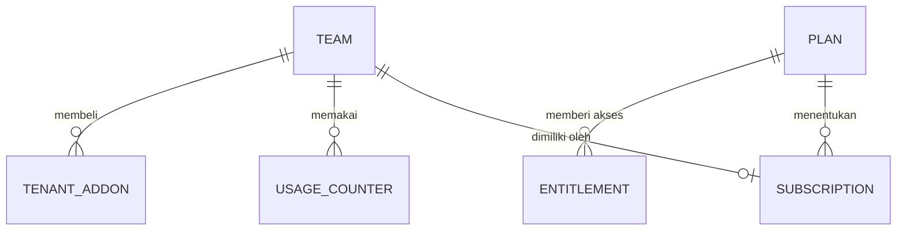
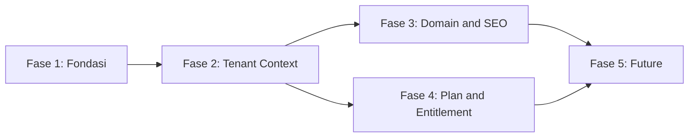

# Rencana Implementasi — Evolusi Alfatech Office menjadi SaaS Multi-Tenant

> **Status:** DRAFT — menunggu review dan persetujuan tim.
> **Versi:** 1.0.0
> **Terakhir diperbarui:** 2026-09-23
> **Pemilik dokumen:** Tech Lead / Software Architect
> **Sifat dokumen:** *Living document* — wajib diperbarui setiap kali ada keputusan, temuan, atau perubahan arsitektur.

Dokumen ini adalah **sumber kebenaran tunggal** (single source of truth) untuk arah arsitektur proyek ini. Dokumen fase (lihat [Bagian 19](#19-roadmap-implementasi-bertahap)) adalah turunan operasional dari dokumen ini.

---

## 0. Cara Membaca Dokumen Ini

### 0.1 Label Status Pekerjaan

Setiap rekomendasi arsitektur **wajib** diberi salah satu label berikut. Aturan ini tidak boleh dilanggar.

| Label | Arti |
|---|---|
| **CURRENT** | Kondisi yang **sudah ada** di repository saat ini. Bukan usulan. |
| **FOUNDATION** | Yang **harus** disiapkan sekarang agar sistem aman berevolusi. Tidak menambah fitur produk. |
| **FUTURE** | Yang **hanya** boleh diimplementasikan setelah fitur produknya disetujui. |
| **DEFERRED** | Yang secara eksplisit **tidak boleh** dikerjakan pada tahap ini. |

### 0.2 Label Status Keputusan

| Label | Arti |
|---|---|
| ✅ **DISETUJUI** | Sudah diputuskan dan tidak perlu dibahas ulang. |
| ⚠️ **PERLU PERSETUJUAN** | Rekomendasi teknis sudah ada, tetapi keputusan akhir ada di tangan tim/product owner. |
| ❓ **TERBUKA** | Belum ada rekomendasi yang cukup kuat; butuh investigasi lebih lanjut. |

### 0.3 Catatan Penting tentang Penomoran ADR/PDR

Repository ini sudah memakai skema penomoran **ADR** (Architecture Decision Record) dan **PDR** (Product Decision Record) di dalam komentar kode (contoh: `ADR-03`, `ADR-09`, `ADR-19`, `PDR-03`, `PDR-05`, `PDR-10`, `PDR-12`).

**Temuan:** dokumen induknya (`docs/IMPLEMENTATION_PLAN.md`) **hilang dari repository** — folder `docs/` tidak ada, sehingga sekitar 50 komentar di kode merujuk ke dokumen yang tidak dapat ditemukan.

**Keputusan tim:** penomoran pada dokumen ini **dimulai ulang dari nol** (`ADR-01`, `PDR-01`, ...).

**Konsekuensi yang harus disadari:** setelah dokumen ini dibuat, komentar kode lama **tetap tidak akan cocok** dengan nomor baru. Penanganannya dibahas di [Lampiran C](#lampiran-c--referensi-aturan-lama-legacy) dan [Lampiran D](#lampiran-d--daftar-berkas-yang-merujuk-ke-referensi-lama), dan **wajib diputuskan** oleh tim (lihat [Bagian 21](#21-keputusan-yang-memerlukan-persetujuan-tim), butir D-01).

---

## 1. Ringkasan Proyek

### 1.1 Asal-usul

Aplikasi ini awalnya adalah **company profile web application** untuk sebuah perusahaan jasa pengembangan software (PT Alfatech Digital Solutions). Satu aplikasi melayani dua wajah:

1. **Portal internal** (butuh login) — manajemen proyek, CRM/leads, kalender konten media sosial, keuangan, portofolio, profil perusahaan, dan log aktivitas.
2. **Website publik** (tanpa login) — halaman profil perusahaan di `/p/{slug-tim}` dengan layanan, portofolio, FAQ, dan formulir konsultasi yang langsung menulis data ke pipeline CRM sebagai lead baru.

### 1.2 Arah Bisnis Jangka Panjang

Produk ingin berkembang menjadi **SaaS multi-tenant berbasis langganan**: banyak perusahaan/organisasi dapat berlangganan dan mengoperasikan website company profile mereka sendiri (dan fitur bisnis lain) dalam satu instalasi aplikasi.

### 1.3 Peringatan Penting

**Fitur SaaS belum difinalkan bersama tim bisnis.**

- Ide paket (Basic/Plus/Pro) dan fitur di dalamnya adalah **konteks arsitektur**, **bukan** requirement yang disetujui.
- Dokumen ini **tidak** mengimplementasikan seluruh ide tersebut.
- Prinsip kerja dokumen ini: **"Siapkan arsitektur, bukan produk."** (*Prepare the architecture, not the product.*)
- Setiap tabel, modul, halaman, API, job, atau integrasi yang tidak disetujui **tidak boleh** dibuat.

### 1.4 Tujuan Tahap Ini

> Membuat aplikasi yang ada **siap berevolusi** menjadi platform SaaS multi-tenant yang *maintainable*, tanpa mengimplementasikan fitur produk yang belum disetujui.

---

## 2. Penilaian Arsitektur Saat Ini (CURRENT)

### 2.1 Teknologi

| Lapisan | Teknologi | Catatan |
|---|---|---|
| Backend | Laravel 13, PHP 8.3+ | `laravel/framework: ^13.17` |
| Frontend | Vue 3.5 (`<script setup lang="ts">`), TypeScript, Inertia 3 | Tanpa Pinia; state via composable + `provide`/`inject` |
| Styling | Tailwind CSS v4 | + `reka-ui` / `shadcn-vue` |
| Build tool | Vite 8 (`vite-plus`) | Dijalankan lewat `vp` |
| Routing frontend | Wayfinder | Helper rute di-generate otomatis |
| Autentikasi | Laravel Fortify 1.37 | Login, 2FA, passkey (`@laravel/passkeys`) |
| Database | SQLite (default) | `DB_CONNECTION=sqlite` |
| Queue | `database` | `QUEUE_CONNECTION=database` |
| Cache | `database` | `CACHE_STORE=database` |
| Session | `database` | `SESSION_DRIVER=database` |
| Testing | PHPUnit 12 + Larastan (PHPStan level 7) | `pint` untuk format |
| Inertia SSR | Diaktifkan di config, **bundle belum dibuild** | `bootstrap/ssr` tidak ada |

### 2.2 Struktur Aplikasi

- **Tidak ada** folder `app/Services` maupun layer repository. Logika domain saat ini berada di Controller + `App\Actions` (hanya `Actions/Teams` dan `Actions/Fortify`).
- Pola yang sudah dipakai dengan baik:
  - `App\Concerns\BelongsToTeam` — trait untuk model milik tenant + query scope `forTeam()`.
  - `App\Concerns\AuthorizesTeamModule` — guard untuk endpoint `index` yang tidak punya FormRequest.
  - `App\Http\Requests\{Module}\Save*Request` dengan base `TeamRequest` untuk otorisasi + validasi.
  - `App\Http\Resources\*Resource` — pemetaan `snake_case` → `camelCase`, dengan `JsonResource::withoutWrapping()`.
  - `App\Observers\ActivityObserver` — mencatat log aktivitas otomatis untuk 7 model domain.
  - `App\Support\CurrentTeam` — resolver `{current_team}` dari route.
  - `App\Data\{UserTeam,TeamPermissions}` — DTO yang dikirim ke frontend.

### 2.3 Multi-Tenancy (Sudah Ada Sebagian)

**Ini temuan terpenting:** proyek **bukan** aplikasi single-tenant yang perlu di-*refactor* menjadi multi-tenant. Fondasi multi-tenancy **sudah ada** dan cukup matang:

- `Team` **berperan sebagai tenant**. Model `Team` memakai `getRouteKeyName() = 'slug'`.
- Seluruh tabel domain punya kolom `team_id` dengan foreign key `cascadeOnDelete`.
- URL internal polanya `/{slug-tim}/...` (route prefix `{current_team}`).
- `EnsureTeamMembership` middleware memvalidasi keanggotaan + role minimum.
- `SetTeamUrlDefaults` middleware mengisi default parameter URL (`current_team`, `team`).
- Otorisasi dua lapis: `TeamRole` (`owner`/`admin`/`member`) → `TeamPermission` (`modul:aksi`), dibagikan ke frontend sebagai prop `teamPermissions` dan dibaca lewat `usePermission()`.
- Ada **platform layer** lintas-tenant: `is_platform_admin` di `users`, middleware `EnsurePlatformAdmin`, `PlatformTenantController` (`/platform/tenants`), dan command `PromotePlatformAdmin`.
- Moderasi platform: `teams.public_page_enabled` untuk menonaktifkan halaman publik tenant tanpa menghapus data.
- Aturan bisnis yang berlaku sekarang: **registrasi hanya lewat undangan** dan **satu user = satu tenant** (personal team dianggap sisa alur lama).

### 2.4 Keterbatasan Arsitektur yang Teridentifikasi

| # | Temuan | Dampak |
|---|---|---|
| A-1 | **Tidak ada global scope untuk isolasi tenant.** Scoping hanya terjadi manual di controller/FormRequest. | Risiko kebocoran data antar-tenant jika satu query lupa di-scope (IDOR). Ini risiko **tertinggi** saat ini. |
| A-2 | Dokumen `docs/IMPLEMENTATION_PLAN.md` hilang; ±50 komentar kode merujuk ke sana. | Jejak keputusan arsitektur hilang; *onboarding* developer baru sulit. |
| A-3 | `Team` memikul dua makna: "tim internal" dan "tenant". | Ambiguitas saat menambah konsep langganan/domain/kuota per tenant. |
| A-4 | Belum ada konsep plan/langganan/entitlement sama sekali. | Tidak ada tempat untuk memutuskan "fitur apa yang boleh dipakai tenant ini". |
| A-5 | Belum ada abstraksi storage. `photo_path`, `media_url`, `image_url` hanya string URL eksternal. | Belum ada jalur aman untuk upload file per tenant. |
| A-6 | Tidak ada resolusi tenant berbasis host/domain. | Custom domain tidak mungkin tanpa perubahan routing. |
| A-7 | SSR produksi belum aktif (`bootstrap/ssr` tidak ada). | SEO halaman publik tenant tidak optimal; crawling bergantung render klien. |
| A-8 | Cache & queue belum tenant-aware. | Kunci cache berpotensi bertabrakan antar-tenant. |
| A-9 | Environment produksi belum dipisahkan (SQLite, cache/queue/session di database). | Belum siap untuk beban multi-tenant nyata. |
| A-10 | `activity_logs` hanya tenant-scoped; tidak ada audit level platform. | Aksi operator platform tidak terekam. |

### 2.5 Kekuatan yang Harus Dipertahankan

- Konvensi `team_id` + trait `BelongsToTeam` sudah konsisten.
- Pemisahan tegas antara otorisasi tenant (`TeamRole`/`TeamPermission`) dan platform (`is_platform_admin`) — keputusan bagus yang **tidak boleh** dicampur.
- Setiap modul domain punya test feature sendiri (`tests/Feature/Domain/*`).
- Quality gate jelas: `composer test` = pint → phpstan (level 7) → phpunit.

---

## 3. Penilaian Database Saat Ini (CURRENT)

Database default: **SQLite**. Seluruh tabel berikut sudah ada:

### 3.1 Klasifikasi Tabel Eksisting

| Tabel | Jenis Data | Tenant-scoped? | Catatan |
|---|---|---|---|
| `users` | Global + data user | ❌ Tidak | Relasi ke tenant lewat `team_members`. Punya `current_team_id`, `is_platform_admin`, `is_active`. |
| `password_reset_tokens` | Sistem | ❌ | — |
| `sessions` | Sistem | ❌ | `SESSION_DRIVER=database` |
| `cache`, `cache_locks` | Sistem | ❌ | Belum tenant-aware (lihat A-8) |
| `jobs`, `job_batches`, `failed_jobs` | Sistem | ❌ | Belum tenant-aware |
| `passkeys` | Autentikasi | ❌ | Fortify passkey |
| `teams` | **Tenant** | — | `name`, `slug` (unique), `is_personal`, `public_page_enabled`, soft deletes |
| `team_members` | Keanggotaan (≈ `tenant_users`) | ✅ | `unique(team_id, user_id)`, kolom `role` |
| `team_invitations` | Onboarding tenant | ✅ | `code` unique, `expires_at`, `accepted_at` |
| `company_profiles` | Tenant-specific (1:1) | ✅ | `team_id` **unique**; `services`/`products`/`social_links`/`faq` sebagai JSON |
| `projects` | Tenant-specific | ✅ | + `lead_id` (unique, nullable) |
| `tasks` | Tenant-specific | ✅ | terhubung ke `projects` |
| `leads` | Tenant-specific | ✅ | — |
| `content_items` | Tenant-specific | ✅ | `platform`, `status`, `media_url` (string) |
| `transactions` | Tenant-specific | ✅ | `amount` = integer rupiah (tanpa subunit) |
| `portfolio_items` | Tenant-specific | ✅ | `image_url` (string), `published`, `featured` |
| `activity_logs` | Tenant-specific | ✅ | `entity_id` bukan FK (tipe entitas bervariasi) |

### 3.2 Catatan Skema

- Uang disimpan sebagai **integer rupiah** (tanpa subunit) — konsekuensi SQLite. Formatting hanya di frontend (`resources/js/utils/formatters.ts`).
- Beberapa kolom sengaja **bukan tanggal asli**: `leads.next_follow_up` dan `content_items.scheduled_at` adalah teks bebas (mis. "Besok pagi"). Ini *technical debt* yang perlu dicatat jika nanti butuh reminder otomatis.
- `activity_logs.entity_id` bertipe string dan bukan FK — desain yang wajar untuk polymorphic log sederhana, tetapi membatasi join.
- Index sudah memadai untuk pola query tenant (`index(['team_id', 'status'])`, dst.).

### 3.3 Klasifikasi Tabel Baru yang Diusulkan

Klasifikasi wajib mengikuti 4 kategori berikut. **Tidak semua tabel ini boleh dibuat sekarang.**

| # | Tabel | Kategori | Fase | Alasan |
|---|---|---|---|---|
| 1 | `tenant_settings` | **Required for SaaS foundation** | 2 | Menampung preferensi per tenant (locale, timezone, warna merek, kuota custom) tanpa menambah kolom ke `teams` setiap ada fitur baru. **Alternatif:** kolom `settings` JSON di `teams` — lihat D-04. |
| 2 | `platform_audit_logs` | **Required for SaaS foundation** | 2 | Audit aksi operator platform (buat/hapus tenant, suspend, moderasi). Mengisi celah A-10. |
| 3 | `plans` | **Required for SaaS foundation** | 4 | Definisi paket (kode, nama, harga acuan). Boleh dimulai sebagai **config + seeder** sebelum jadi tabel — lihat D-06. |
| 4 | `domains` | **Required for SaaS foundation** | **Gelombang 2** | Pemetaan host ↔ tenant, status verifikasi. Ditunda bersama Fase 3 bagian domain (2026-09-30). |
| 5 | `subscriptions` | ✅ **Disetujui 2026-09-30** | **Gelombang 1** | Status langganan per tenant; dibutuhkan SaaS billing. Provider diputuskan lewat D-05. |
| 5b | `invoices` | ✅ **Disetujui 2026-09-30** | **Gelombang 1** | Invoice langganan SaaS + payment link untuk pelanggan tenant (B-2 & B-5 Lite). |
| 6 | `feature_entitlements` | **Optional — kemungkinan tidak perlu** | 4 | Sebaiknya cukup `Feature` enum + mapping plan→feature di config. Tabel hanya jika butuh override per tenant dalam jumlah besar. |
| 7 | `usage_counters` | Required **only when** kuota dipakai | 4 | Hitungan pemakaian (mis. jumlah AI call, penyimpanan). Defer sampai kuota nyata disetujui. |
| 8 | `tenant_addons` | Required **only when** add-on disetujui | 4 | Pembelian add-on per tenant. |
| 9 | `tenants` (terpisah dari `teams`) | **Optional — tidak direkomendasikan** | — | Menduplikasi `teams` akan memaksa migrasi besar tanpa manfaat jelas. Lihat ADR-02. |
| 10 | `tenant_databases` | **Optional — tidak direkomendasikan** | — | Hanya relevan bila memilih database-per-tenant. Lihat ADR-01. |
| 11 | `products`/`orders`/`carts` | Defer — keputusan "Lite dulu" | **Gelombang 2** | E-commerce penuh; payment versi Lite tidak memerlukannya. |
| 12 | `whatsapp_*` | ✅ **Disetujui 2026-09-30** | **Gelombang 1** | WhatsApp bot dua arah. |
| 13 | `ai_*` | Defer — fitur belum disetujui | 5 | AI/automation. |

### 3.4 Prinsip Perubahan Skema

1. **Aditif dan *backward compatible*.** Kolom baru harus nullable atau punya default.
2. **Jangan mengganti nama `team_id`.** Seluruh kode sudah memakainya; renamenya berbiaya besar tanpa manfaat (ADR-02).
3. Setiap tabel tenant-specific baru **wajib** punya `team_id` + FK `cascadeOnDelete` + index `(team_id, ...)`.
4. Setiap perubahan skema wajib disertai test isolasi tenant.

---

## 4. Penilaian Storage Saat Ini (CURRENT)

### 4.1 Kondisi Nyata

- **Belum ada upload file sama sekali.** Direktori `storage/app/private` dan `storage/app/public` hanya berisi `.gitignore`.
- Tidak ada pemanggilan `Storage::`, `->store()`, `storeAs()`, atau `putFile()` di seluruh `app/`.
- `users.photo_path` ada di skema, tetapi **tidak ada controller/request yang mengisinya** — kolom ini praktis tidak terpakai.
- `content_items.media_url` dan `portfolio_items.image_url` adalah **string URL eksternal** (seeder memakai `https://images.unsplash.com/...`), divalidasi hanya dengan `['nullable', 'string', 'max:2048']`.
- Disk default: `FILESYSTEM_DISK=local` → `storage/app/private`. Disk `public` tersedia (`storage/app/public`, URL `/storage`). Disk `s3` **sudah dikonfigurasi** tetapi belum dipakai.
- `public/storage` (symlink) ada di `.gitignore` — artinya `php artisan storage:link` belum dijalankan.

### 4.2 Implikasi

| # | Risiko/Keterbatasan |
|---|---|
| S-1 | Belum ada konvensi path file per tenant → saat upload pertama dibuat, berpotensi tabrakan nama antar-tenant. |
| S-2 | `media_url`/`image_url` menerima URL sembarang (potensi SSRF bila nanti di-fetch server-side; saat ini hanya dirender di ``, jadi risikonya rendah tapi perlu dicatat). |
| S-3 | Belum ada mekanisme hapus file saat tenant dihapus (belum ada file, jadi belum jadi masalah). |
| S-4 | Belum ada validasi tipe/ukuran file karena belum ada upload. |

Kesimpulan: **CURRENT** storage = praktis kosong. Inilah kesempatan terbaik menetapkan konvensi isolasi **sebelum** upload pertama ditulis.

---

## 5. Penilaian Autentikasi & Otorisasi Saat Ini (CURRENT)

### 5.1 Autentikasi

- Laravel Fortify: login, reset password, verifikasi email, 2FA (TOTP + recovery codes), passkey.
- **Registrasi hanya lewat undangan.** `Fortify::registerView()` menolak bila tidak ada `TeamInvitation` yang valid.
- Rate limit login: 5/menit per (email+IP); 2FA: 5/menit per sesi login.
- `App\Rules\InviteeHasNoOtherTeam` menegakkan aturan **satu user = satu tenant**.
- Response login/register/2FA/verifikasi dikustomisasi via `App\Http\Responses\*` agar tahu `current_team_id`.

### 5.2 Otorisasi

Tiga lapis, terpisah dengan benar:

| Lapis | Mekanisme | Cakupan |
|---|---|---|
| Keanggotaan | `EnsureTeamMembership` middleware | User harus anggota tenant di URL |
| Peran → permission | `TeamRole` → `TeamPermission` (`modul:aksi`) | Di dalam satu tenant |
| Platform | `is_platform_admin` + `EnsurePlatformAdmin` | Lintas tenant (buat/hapus/moderasi tenant) |

- Permission dibagikan ke frontend via `HandleInertiaRequests` (`teamPermissions`) — server tetap otoritas akhir.
- Ada `TeamPolicy` untuk `viewAny`/`create`/`delete`.
- **Belum ada** konsep entitlement/plan — jadi otorisasi hanya berbasis peran, belum berbasis langganan.

### 5.3 Temuan Otorisasi

| # | Temuan |
|---|---|
| O-1 | Otorisasi bergantung pada scoping manual. Tidak ada *defense in depth* di level query (lihat A-1). |
| O-2 | `EnsureTeamMembership` memanggil `belongsToTeam()` yang menjalankan query `exists()` per request — bisa dioptimasi, tapi bukan prioritas. |
| O-3 | Belum ada otorisasi berbasis plan. Nanti **tidak boleh** ditulis sebagai `if ($user->plan === 'pro')` yang tersebar (lihat [Bagian 12](#12-strategi-feature-entitlement)). |

---

## 6. Arsitektur Target

### 6.1 Prinsip

1. **Shared database, shared schema** dengan isolasi baris lewat `team_id` (ADR-01).
2. **`Team` tetap menjadi Tenant.** Tidak ada tabel `tenants` baru (ADR-02).
3. **Isolasi wajib berlapis:** global scope + aturan konvensi + test otomatis (ADR-03).
4. **Semua fitur berbayar lewat abstraksi entitlement**, bukan pengecekan tersebar (ADR-06).
5. **Semua akses file melewati seam (titik sambung) storage** dengan path tenant-aware (ADR-05).
6. **Resolusi tenant tidak boleh diasumsikan dari slug URL saja** — harus ada abstraksi resolver agar host/domain bisa masuk nanti (ADR-04).
7. **Konfigurasi, bukan kode**, untuk definisi plan/kuota yang belum final.

### 6.2 Diagram Arsitektur Target

```mermaid
flowchart TB
    subgraph Request["Request Lifecycle"]
        A[HTTP Request] --> B{Tenant Resolver}
        B -->|slug path /p/{team}| C[TenantContext]
        B -->|host / domain - FUTURE| C
        C --> D[Middleware: Membership + Platform guard]
        D --> E[Controller / Actions]
    end
    subgraph Domain["Domain Layer"]
        E --> F[Model + Global Team Scope]
        F --> G[(Shared DB: team_id)]
    end
    subgraph Cross["Cross-cutting FOUNDATION"]
        H[Entitlements Service]
        I[Storage Seam tenants/{id}/]
        J[Platform Audit Log]
    end
    E -.-> H
    E -.-> I
    E -.-> J
    subgraph Delivery["Delivery"]
        E --> K[Inertia + Vue]
        K --> L[SSR / SEO]
    end
```

### 6.3 Perbandingan Status per Area

| Area | CURRENT | FOUNDATION | FUTURE | DEFERRED |
|---|---|---|---|---|
| Multi-tenancy | Sudah berjalan (`team_id` + middleware) | Global scope + test kebocoran | — | — |
| Identitas tenant | `Team` = tenant | Tetapkan resmi di ADR + istilah "tenant" | — | Tabel `tenants` baru |
| Storage | Kosong | Konvensi `tenants/{id}/` + seam | Upload/Media manager | Manajemen media penuh |
| Domain | Hanya slug path | **Gelombang 2:** resolver abstraksi + konfigurasi base domain | Tabel `domains` + verifikasi + SSL | Implementasi custom domain |
| Langganan | Belum ada | `Feature` enum + plan di config **(gelombang 1)** | **Gelombang 1:** tabel `plans`/`subscriptions`/`invoices` + billing langganan | Payment gateway untuk **pesanan** (butuh katalog) |
| SEO | Halaman publik dasar | SSR produksi + meta/OG/canonical **(gelombang 1)** | Sitemap/robots/structured data per tenant + **otomasi dasar** (gelombang 1) | Otomasi SEO berbasis AI / skor konten |
| AI | Belum ada | — | Provider abstraction + kuota | Implementasi AI apa pun |
| Infrastruktur | SQLite lokal | Pisahkan config produksi | MySQL/Postgres + object storage + reverse proxy | Auto-scaling, multi-region |

---

## 7. Strategi Multi-Tenancy

### 7.1 Perbandingan Pendekatan

| Pendekatan | Isolasi | Kompleksitas | Biaya migrasi | Kesesuaian proyek ini |
|---|---|---|---|---|
| **Shared DB / shared schema** (`team_id`) | Logis (baris) | Rendah | Rendah | ✅ **Paling praktis** |
| Database-per-tenant | Fisik | Tinggi | Tinggi | ❌ Belum sebanding dengan skala sekarang |
| Hybrid (shared + schema/DB khusus) | Campuran | Sangat tinggi | Sangat tinggi | ❌ Prematur |

**Rekomendasi (⚠️ PERLU PERSETUJUAN — D-02):** tetap **shared database, shared schema**.

**Alasan:**
1. Sudah menjadi kenyataan di kode — `team_id`, `BelongsToTeam`, dan `forTeam()` sudah konsisten. Berganti pendekatan berarti menulis ulang, bukan menyiapkan.
2. Skala tenant saat ini kecil dan belum diketahui; biaya operasional database-per-tenant (migrasi per tenant, backup per tenant, koneksi) tidak sebanding.
3. SQLite→MySQL/Postgres adalah peningkatan *infrastruktur*, bukan perubahan model tenancy — jauh lebih murah.
4. Kebutuhan nyata saat ini adalah **menutup celah kebocoran** (A-1), bukan isolasi fisik.

**Kapan keputusan ini harus ditinjau ulang:** jika muncul kebutuhan *data residency* per tenant, atau satu tenant memerlukan beban yang mengganggu tenant lain (noisy neighbour). Ini dicatat sebagai **FUTURE** dengan jalur migrasi di [Bagian 18](#18-strategi-migrasi).

### 7.2 Titik Isolasi yang Wajib Diperhatikan

Berdasarkan requirement, inilah analisis per titik beserta statusnya:

| Titik | CURRENT | FOUNDATION yang dibutuhkan |
|---|---|---|
| Identifikasi tenant | Slug di URL (`{current_team}`), resolver `App\Support\CurrentTeam` | Abstraksi `TenantResolver` (ADR-04) — ⏸️ **gelombang 2** |
| Siklus hidup tenant | Buat/hapus via platform layer; soft delete di `teams` | Tambah status (suspend/aktif) + audit platform |
| Kepemilikan tenant | `TeamRole::Owner` via `team_members` | Tetap; jangan campur dengan `is_platform_admin` |
| Relasi user–tenant | `team_members` (many-to-many), aturan bisnis 1 user = 1 tenant | Tetap; dokumentasikan agar tidak dilonggarkan tanpa keputusan |
| Batas otorisasi | `TeamRole`→`TeamPermission`, `TeamPolicy`, `EnsureTeamMembership` | Tambah otorisasi berbasis entitlement (Fase 4) |
| Route tenant-aware | Prefix `{current_team}` | Pisahkan route publik agar bisa di-resolve per host — ⏸️ **gelombang 2** |
| Controller/service | Resolve tenant manual per controller (`CurrentTeam::from`) | Sentralkan ke `TenantContext` (Fase 2) |
| Query tenant-aware | Manual via `forTeam()` | **Global scope** + escape hatch eksplisit (ADR-03) |
| Isolasi tenant | Logis, rawan human error | Test kebocoran otomatis wajib di CI |
| Middleware | `EnsureTeamMembership`, `SetTeamUrlDefaults`, `EnsurePlatformAdmin` | Tambah `ResolveTenant` (host-aware) — ⏸️ **gelombang 2** |
| Policy | `TeamPolicy` | Perluas seiring modul baru |
| Background job | Belum ada job | Job wajib membawa `team_id` + konteks (Fase 2) |
| Scheduled task | Hanya hapus invitation kedaluwarsa | Task per-tenant harus iterasi tenant dengan konteks benar |
| Caching | Tidak ada pemakaian cache eksplisit | Kunci cache wajib ber-namespace tenant (ADR-09) |
| Filesystem/storage | Kosong | Path `tenants/{id}/...` (ADR-05) |
| Notifikasi | Hanya `App\Notifications\Teams\*` (undangan) | Notifikasi tenant-aware: sertakan konteks tenant |
| Logging | Log standar tanpa konteks tenant | Tambahkan `team_id` ke konteks log |
| Custom domain | Belum ada | Lihat [Bagian 10](#10-strategi-domain--custom-domain) |

### 7.3 Isolasi Berlapis (FOUNDATION — ADR-03)

Strategi yang direkomendasikan, berurutan:

1. **`TenantContext` service** (singleton per request) menyelesaikan tenant aktif dari resolver.
2. **Global scope** pada semua model `BelongsToTeam`: otomatis menambahkan `where team_id = context`. Bila tidak ada konteks tenant, query **gagal keras** (fail loudly) untuk model tenant-scoped — kecuali di mode konsol/platform yang eksplisit.
3. **Escape hatch eksplisit**: `withoutTeamScope()` yang namanya jelas-jelas menyatakan maksud, sehingga mudah diaudit saat *code review*.
4. **Test kebocoran anti-regresi**: fixture 2 tenant berisi data mirip; test memastikan tenant A tidak pernah melihat data tenant B untuk seluruh endpoint.

> ⚠️ **Perlu persetujuan (D-03):** global scope adalah perubahan perilaku yang menyentuh hampir semua query. Ada risiko query platform/cross-tenant ikut ter-scope. Karena itu langkah ini **wajib** disertai test menyeluruh sebelum digabung.

---

## 8. Strategi Database

**Rekomendasi:** shared database, shared schema (selaras [Bagian 7](#7-strategi-multi-tenancy)).

### 8.1 Aturan Baku

1. Setiap tabel tenant-specific: `team_id` (FK, `cascadeOnDelete`), index `(team_id, kolom_filter_utama)`.
2. Tabel global (system/user/auth) **tidak** diberi `team_id`.
3. Tabel lintas-tenant (platform) diberi nama berawalan `platform_` agar jelas dan mudah diaudit.
4. Kolom baru bersifat aditif, nullable, atau berdefault.

### 8.2 Perubahan Database per Fase

| Fase | Perubahan | Status |
|---|---|---|
| 1 | Tidak ada perubahan skema. Fokus pada test + dokumentasi. | FOUNDATION |
| 2 | `tenant_settings` (atau kolom `settings` JSON di `teams`), `platform_audit_logs`, status tenant di `teams` | FOUNDATION |
| 3 | **Gelombang 1: tidak ada perubahan skema** (SEO saja). `domains` → **gelombang 2** | GESER |
| 4 | `plans` (**config dulu**), `subscriptions` + `invoices` + kuota dasar → **gelombang 1** | FOUNDATION + **Gelombang 1** |
| 5 | `products`/`orders`/dsb. | **Gelombang 2** |

### 8.3 Pertimbangan Database Engine

**CURRENT:** SQLite. Cocok untuk pengembangan dan test, **tidak** disarankan untuk produksi multi-tenant (locking tingkat database, tidak ada concurrent write yang baik).

**FOUNDATION:** siapkan konfigurasi agar berpindah ke **MySQL 8 / PostgreSQL** tanpa perubahan kode:
- Hindari fitur spesifik SQLite (sudah cukup baik saat ini: integer rupiah & JSON kolom kompatibel).
- Pastikan semua migrasi berjalan di MySQL **dan** Postgres di CI.
- `json` kolom → gunakan tipe JSON native (bukan text) agar dapat di-query.

**Catatan:** perpindahan ini **tidak** mengubah arsitektur tenancy, tetapi wajib disertai pengujian karena perilaku index `unique` terhadap NULL dan kolasi string bisa berbeda.

---

## 9. Strategi Storage

### 9.1 CURRENT

Praktis tidak ada storage (lihat [Bagian 4](#4-penilaian-storage-saat-ini-current)).

### 9.2 FOUNDATION — Konvensi & Seam (ADR-05)

1. **Tetapkan disk khusus tenant**, mis. `tenants`, di `config/filesystems.php`, dengan root terparameterisasi. Semua file tenant **wajib** ditulis lewat disk ini.
2. **Konvensi path wajib:** `tenants/{team_id}/{kategori}/{file}` — contoh: `tenants/7/portfolio/hero.jpg`, `tenants/7/company-profile/logo.png`.
   - `team_id` (bukan slug) agar tetap stabil walau slug berubah.
   - `{kategori}` memisahkan domain (portfolio, content, profile).
3. **Helper bersih** (mis. `App\Support\TenantStorage`) yang otomatis menambahkan prefix `tenants/{id}/` sehingga developer tidak pernah menulis path mentah.
4. **Validasi upload** (saat upload pertama dibuat): whitelist mime, batas ukuran, sanitasi nama file, simpan nama acak (bukan nama asli), jangan simpan di `public/` langsung.
5. **Sisakan jalur migrasi ke object storage.** Karena Laravel memakai Flysystem, berpindah dari `local` → `s3` cukup mengganti `FILESYSTEM_DISK`/konfigurasi disk. **Kode tidak boleh** bergantung pada `storage_path()` atau asumsi path lokal.
6. **Kebijakan penghapusan:** saat tenant dihapus, tandai file untuk dihapus (job terpisah, bukan sinkron dalam request). Ikuti pola soft delete yang sudah dipakai.

### 9.3 FUTURE

- Upload/Media Manager (UI, thumbnail, optimasi gambar).
- Migrasi ke S3-compatible storage.
- Kuota penyimpanan per tenant (butuh hitungan ukuran → kaitkan dengan `usage_counters`).

### 9.4 DEFERRED

- Media library penuh, transformasi gambar on-the-fly, CDN, deduplikasi file.

> ⚠️ **Perlu persetujuan (D-07):** pemilihan object storage (S3-compatible: AWS S3 / MinIO / Cloudflare R2 / Wasabi) dan batas kuota.

**Catatan penting:** FOUNDATION di sini **hanya** berupa konvensi, konfigurasi disk, dan helper. **Tidak** ada fitur upload, UI, atau tabel media — karena belum ada satu pun fitur produk yang membutuhkannya saat ini.

---

## 10. Strategi Domain / Custom Domain

Custom domain adalah fitur potensial untuk tier tinggi dan **belum disetujui**. Bagian ini memisahkan dengan tegas apa yang disiapkan, apa yang ditunda, dan apa yang butuh kerja infrastruktur.

### 10.1 Bagian A — Yang Disiapkan Sekarang (FOUNDATION)

1. **Abstraksi `TenantResolver`.** Sumber tenant saat ini = slug di path. Buat antarmuka resolver dengan implementasi slug, dan siapkan slot implementasi host. Ini membuat perubahan nanti bersifat *menambah*, bukan *menulis ulang*.
2. **Konfigurasi base domain.** Tambahkan kunci config (mis. `tenancy.base_domain`, `tenancy.subdomain_enabled`) dengan default `null`. **Belum** ada perilaku yang bergantung padanya.
3. **Pisahkan route publik dari route internal.** Route publik (`/p/{team}`) harus bisa dipindah ke resolusi host tanpa menyentuh route internal.
4. **Pemetaan konsep di dokumen:** `domains` (host, `team_id`, `is_primary`, `status`, `verified_at`) — desain kolom, index `unique(host)`, dan index `(team_id, is_primary)`.
5. **`TenantContext` menyimpan asal resolusi** (path/host) agar logging & debugging jelas.
6. **Strategi cache yang aman terhadap Host header** — lihat 10.4.

### 10.2 Bagian B — Yang Ditunda (DEFERRED)

- Tabel `domains` + CRUD UI untuk tenant mendaftarkan domain.
- **Verifikasi kepemilikan domain** (TXT/CNAME record + polling).
- Status domain: `pending` → `verifying` → `active` → `failed`.
- Penentuan **domain primer** + redirect dari domain non-primer.
- Middleware `ResolveTenantFromHost`.
- Wildcard subdomain per tenant (`{slug}.app.example.com`).

### 10.3 Bagian C — Kerja Infrastruktur yang Akan Dibutuhkan (FUTURE)

| Kebutuhan | Detail |
|---|---|
| DNS | Wildcard `*.app.example.com` untuk subdomain tenant; record A/CNAME untuk domain kustom |
| Reverse proxy | Nginx/Caddy harus meneruskan `Host` apa adanya dan merutekan ke aplikasi |
| SSL/TLS | Sertifikat per domain kustom. Opsi: ACME otomatis (Caddy/Let's Encrypt), atau Cloudflare for SaaS |
| Verifikasi | Batas waktu propagasi DNS; UI status |
| Staging | Domain uji terpisah (mis. `staging.app.example.com`) |
| Lokal | Gunakan `{slug}.localhost` atau entri `hosts` — **jangan** hardcode di kode |
| Observability | Log per host; alert bila verifikasi SSL gagal |

### 10.4 Pertimbangan Keamanan Domain (WAJIB dibaca sebelum implementasi)

- **Host header injection.** Domain dari request **tidak boleh** dipercaya. Host harus dicocokkan ke tabel `domains` sebelum dipakai; bila tidak cocok → 404.
- **Domain takeover.** Domain yang sudah tidak diverifikasi **tidak boleh** tetap aktif.
- **Canonical/redirect loop.** Domain non-primer harus redirect sekali, bukan berputar.
- **Cookie/session.** `SESSION_DOMAIN` perlu ditinjau; cookie tidak boleh bocor antar domain tenant.
- **Rate limit verifikasi** untuk mencegah abuse.

---

## 11. Strategi Arsitektur Subscription

### 11.1 Prinsip

1. **Jangan hard-code fitur paket.** Fitur Basic/Plus/Pro **belum final**, sehingga definisinya harus berada di **config/seeder**, bukan di `match` atau `if` di dalam kode domain.
2. **Jangan pernah menulis** `if ($user->plan === 'pro')` atau `if ($team->plan === 'plus')` di controller/view. Semua akses fitur lewat service entitlement ([Bagian 12](#12-strategi-feature-entitlement)).
3. **Langganan melekat pada tenant, bukan pada user.** Ini konsekuensi langsung dari ADR-02.

### 11.2 Model Konseptual



### 11.3 Status Langganan

Status minimal yang harus ada: `trialing`, `active`, `past_due`, `canceled`, `expired`, `suspended`. **Saat ini belum ada tabel** — tabel `plans`/`subscriptions`/`invoices` dibuat di **gelombang 1** (disetujui 2026-09-30).

### 11.4 Yang Disiapkan vs Ditunda

| Item | Status |
|---|---|
| `Feature` enum + definisi plan di config | **FOUNDATION** (Fase 4) — gelombang 1 |
| Service `Entitlements` (`can(Feature)`) | **FOUNDATION** (Fase 4) — gelombang 1 |
| Tabel `plans` | Config dulu (D-06) — gelombang 1 |
| Tabel `subscriptions` + `invoices` | ✅ **Gelombang 1** (disetujui 2026-09-30) |
| SaaS billing (langganan tenant → platform) | ✅ **Gelombang 1** |
| Payment link/invoice untuk pelanggan tenant (B-5 Lite) | ✅ **Gelombang 1** |
| Payment gateway untuk **pesanan** (butuh katalog) | **Gelombang 2** |
| Add-on | FUTURE (desain saja) |
| Kuota/usage counter | Sebagian gelombang 1 (kuota dasar); sisanya FUTURE |

> ⚠️ **Perlu persetujuan (D-05):** pilihan billing provider (Midtrans/Xendit untuk Indonesia, atau Stripe/Paddle untuk internasional), model harga (bulanan/tahunan), dan apakah penagihan manual di awal.

**Catatan khusus konteks Indonesia:** bila memilih Midtrans/Xendit, perhatikan bahwa keduanya bukan "subscription billing" penuh seperti Stripe — status langganan kemungkinan harus dikelola sendiri (tabel `subscriptions` + job pengecekan), bukan diserahkan sepenuhnya ke provider. Ini memengaruhi desain `subscriptions` dan perlu keputusan tim.

---

## 12. Strategi Feature Entitlement

### 12.1 Masalah yang Dihindari

Cara yang **harus dihindari**:

```php
// ❌ JANGAN — tersebar, sulit diuji, sulit diubah saat paket berubah
if ($team->plan === 'pro') { /* ... */ }
```

### 12.2 Pola yang Direkomendasikan (FOUNDATION)

```php
// ✅ Enum fitur — satu sumber kebenaran
enum Feature: string {
    case CompanyProfile = 'company_profile';
    case ContentManagement = 'content_management';
    case CustomDomain = 'custom_domain';
    case WhatsAppIntegration = 'whatsapp_integration';
    case Catalog = 'catalog';
    case PaymentGateway = 'payment_gateway';
    case Cashflow = 'cashflow';
    case AdvancedSeo = 'advanced_seo';
    case AiAssist = 'ai_assist';
    case Analytics = 'analytics';
}

// ✅ Mapping plan → fitur, di config (bukan kode)
'plans' => [
    'basic' => ['company_profile', 'content_management'],
    'plus'  => ['...basic', 'custom_domain', 'whatsapp_integration', 'catalog', 'payment_gateway', 'cashflow'],
    'pro'   => ['...plus', 'advanced_seo', 'ai_assist', 'analytics'],
],

// ✅ Pemakaian di mana pun
abort_unless($tenant->can(Feature::CustomDomain), 403);
```

> **Catatan (2026-09-30):** blok di atas adalah **contoh bentuk**, bukan daftar final. Yang sudah disetujui gelombang 1: `WhatsAppIntegration`, `PaymentGateway` (versi Lite), `Cashflow`, dan otomasi SEO **dasar**. `CustomDomain`, `Catalog`, `AiAssist`, `Analytics`, dan SEO lanjutan **belum** boleh masuk enum sampai arahnya disetujui — lihat Fase 4 tugas 4.1.2.

### 12.3 Istilah dan Pemisahan Tanggung Jawab

| Konsep | Arti | Contoh |
|---|---|---|
| **Plan entitlement** | Fitur yang didapat karena paket | Plus → `custom_domain` |
| **Add-on entitlement** | Fitur yang dibeli terpisah | Basic + beli `cashflow` |
| **Feature flag** | Saklar rilis teknis (untuk semua atau sebagian tenant) | `new_dashboard` |
| **Quota** | Batas kuantitatif | maks. 100 item konten |
| **Usage limit** | Pemakaian aktual terhadap kuota | 37/100 |

**Penting:** `TeamPermission` (peran: siapa yang boleh) dan `Feature` (entitlement: apa yang dibolehkan) adalah **dua hal berbeda** dan harus tetap terpisah. Sebuah fitur hanya dapat diakses bila **keduanya** terpenuhi.

### 12.4 Sisi Frontend

- Prop `features`/`entitlements` dibagikan sebagai **daftar boolean/string** (mirip pola `teamPermissions` yang sudah ada).
- Buat composable sejenis `usePermission()` → `useFeatures()` dengan `can()`.
- Frontend **tidak boleh** menebak dari nama plan.

> ⚠️ **Perlu persetujuan (D-06):** apakah definisi plan disimpan sebagai **config** (ringan, mudah diubah, tidak bisa diubah runtime) atau **tabel `plans`** (bisa diubah dari panel platform). Rekomendasi teknis: **mulai dari config**, promosikan ke tabel hanya bila panel admin plan benar-benar dibutuhkan.

---

## 13. Strategi Arsitektur SEO

### 13.1 CURRENT

- Halaman publik ada di `/p/{slug-tim}` (`PublicCompanyProfileController`, Inertia page `public/company-profile`).
- SSR **diaktifkan** di `config/inertia.php` tetapi bundle `bootstrap/ssr` **tidak ada** → Inertia *fallback* ke render klien.
- **Belum ada:** meta title/description dinamis, Open Graph, canonical, `sitemap.xml`, `robots.txt` per tenant, structured data.
- Halaman publik hanya menampilkan data yang sudah ada: profil, portofolio terbit, layanan, FAQ.

### 13.2 Pemisahan Kemampuan

| Kapabilitas | Kategori | Fase |
|---|---|---|
| SSR produksi aktif (build + server Node) | **FOUNDATION** | 1 |
| Meta title/description dari `company_profiles` | **FOUNDATION** | 1/3 |
| Open Graph + Twitter card dasar | **FOUNDATION** | 3 |
| Canonical URL (pakai slug path dulu, domain primer nanti) | **FOUNDATION** | 3 |
| Structured data (`LocalBusiness` JSON-LD) dari profil | **FOUNDATION** | 3 |
| `robots.txt` per tenant | **FOUNDATION** | 3 |
| `sitemap.xml` per tenant (profil + portofolio terbit) | **FOUNDATION** | 3 |
| Otomasi meta/schema + ping sitemap (B-8 dasar) | **Gelombang 1** | G1 |
| SEO teknis lanjutan (hreflang, breadcrumb schema, redirect manager) | FUTURE | 5 |
| Saran SEO otomatis / berbasis AI, skor konten, audit on-page, Search Console | **DEFERRED** | 5 |

### 13.3 Prinsip

1. **URL publik tenant harus stabil.** Saat custom domain masuk, URL path lama tetap berfungsi (redirect 301 ke domain primer) agar peringkat tidak hilang.
2. **Semua data SEO berasal dari database tenant**, bukan hardcode.
3. **Sitemap/robots harus menghormati `public_page_enabled`** — tenant yang dinonaktifkan tidak boleh diindeks.
4. **Otomasi SEO dibatasi.** Gelombang 1 hanya **otomasi meta/schema + ping sitemap** (B-8 dasar). Skor konten, audit on-page, dan Search Console tetap ditunda.

---

## 14. Pertimbangan AI / Automation

**Status: FUTURE / DEFERRED — tidak ada implementasi sekarang.**

Analisis kekhawatiran arsitektur yang akan relevan nanti:

| Aspek | Pertimbangan |
|---|---|
| API key | Simpan per platform (bukan per tenant) di `.env`/secret manager; **jangan** di database tenant |
| Provider abstraction | Bungkus di interface (mis. `AiProvider`) agar vendor bisa ditukar; jangan panggil SDK vendor langsung dari controller |
| Usage tracking | Setiap pemanggilan harus tercatat per tenant (kaitkan `usage_counters`) |
| Quota | Batas pemakaian per plan → lewat entitlement ([Bagian 12](#12-strategi-feature-entitlement)) |
| Biaya | Biaya variabel; perlu perhitungan margin per plan sebelum fitur dijanjikan |
| Queue/job | AI **wajib** asinkron (queue), bukan di dalam request HTTP |
| Retry & idempotency | Job AI harus idempoten; batasi jumlah retry untuk menghindari biaya berulang |
| Rate limit | Batas per menit per tenant, selain batas global provider |
| Isolasi tenant | Konteks tenant **wajib** dibawa ke job; prompt/log tidak boleh bocor antar-tenant |
| Logging | Log pemakaian & kegagalan; jangan log isi prompt yang mengandung data sensitif tenant |
| Billing | Bila AI berdampak biaya, butuh keputusan: dibatasi kuota atau ditagih sebagai add-on |

**Yang boleh disiapkan sekarang:** tidak ada. Ini murni kandidat arsitektur. Cukup dicatat agar keputusan nanti tidak bertabrakan dengan entitlement & queue.

---

## 15. Pertimbangan Keamanan

### 15.1 Risiko Utama (Prioritas Tinggi)

| # | Risiko | Deskripsi | Mitigasi |
|---|---|---|---|
| R-1 | **Kebocoran data antar-tenant** | Scoping manual → satu query lupa `forTeam()` = data tenant lain terbaca. | Global scope + test kebocoran otomatis (ADR-03). |
| R-2 | **Penyalahgunaan `is_platform_admin`** | Bila ada cara memperoleh flag ini tanpa kontrol. | Hanya via command/seed; jangan pernah mass-assign dari input user. Sudah ter-*guard* di `EnsurePlatformAdmin`, pertahankan. |
| R-3 | **Host header injection** (saat custom domain) | Host dipercaya untuk menentukan tenant → bisa mengalihkan ke tenant lain. | Cocokkan host ke `domains` sebelum dipakai; tolak bila tidak ada. |
| R-4 | **IDOR pada route tenant** | Middleware sudah memvalidasi keanggotaan, tetapi scoping resource tetap manual. | Route model binding + policy + global scope. |
| R-5 | **Mass assignment** | Laravel 13 memakai atribut `#[Fillable]`. | Pertahankan whitelist; jangan tambahkan `team_id` ke fillable bila berasal dari input. |

### 15.2 Risiko Lain

| # | Risiko | Mitigasi |
|---|---|---|
| R-6 | Public consultation form (tulis lead) | Sudah ada `throttle:5,1` — pertahankan; tambah honeypot/captcha bila spam muncul |
| R-7 | Halaman publik tenant dinonaktifkan masih bisa diakses | Sudah di-*handle* (404) — jaga testnya |
| R-8 | URL eksternal di `media_url`/`image_url` | Validasi skema URL (http/https), jangan render sebagai HTML |
| R-9 | Session/cookie lintas domain tenant | Tinjau `SESSION_DOMAIN` saat custom domain masuk |
| R-10 | Aktivitas operator platform tidak terekam | Tambah `platform_audit_logs` (Fase 2) |
| R-11 | Tidak ada CSP/security header eksplisit | Tinjau penambahan security header di Fase 1 |
| R-12 | Password policy hanya aktif di produksi | Sudah ada `Password::defaults` — pastikan benar-benar dijalankan di produksi |

### 15.3 Prinsip

1. **Fail closed.** Bila konteks tenant tidak jelas → tolak, jangan tebak.
2. **Server adalah otoritas akhir.** UI menyembunyikan menu ≠ keamanan; backend wajib tetap memvalidasi.
3. **Defense in depth.** Middleware + policy + global scope, bukan salah satu saja.

---

## 16. Strategi Testing

### 16.1 CURRENT

- `tests/Feature/Domain/*` — satu test per modul (`ProjectTest`, `LeadTest`, `TaskTest`, `ContentItemTest`, `TransactionTest`, `PortfolioItemTest`, `CompanyProfileTest`, `ActivityLogTest`) + `AuthorizationTest`, `IndexPayloadShapeTest`, `DomainTestCase`.
- `tests/Feature/Teams/*`, `tests/Feature/Platform/*`, `tests/Feature/Public/*`, `tests/Feature/Auth/*`, `tests/Feature/Settings/*`.
- `tests/Unit` ada tetapi masih tipis.
- Quality gate: `composer test` → `pint --test` → `phpstan level 7` → `phpunit`.

### 16.2 Tambahan yang Dibutuhkan (FOUNDATION)

| Jenis Test | Tujuan | Prioritas |
|---|---|---|
| **Test isolasi tenant** | Dua tenant dengan data mirip; pastikan tenant A tidak pernah melihat/mengubah data tenant B di **setiap** endpoint | **Tinggi** |
| Test resolusi tenant | Slug valid/invalid, non-anggota, tenant dinonaktifkan | Tinggi |
| Test entitlement | Plan A tidak boleh akses fitur plan B | Sedang (Fase 4) |
| Test moderasi platform | Tenant dengan `public_page_enabled=false` → 404 di halaman publik & form | Sedang |
| Test storage path | Helper menulis ke `tenants/{id}/...`, menolak path di luar prefix | Sedang |
| Contract test payload | Sudah ada `IndexPayloadShapeTest` — perluas saat menambah prop baru | Sedang |
| Test cross-engine | Jalankan migrasi di MySQL/Postgres (bukan hanya SQLite) | Sedang |

### 16.3 Prinsip

1. **Setiap aturan keamanan tenant wajib punya test** — bukan hanya kebahagiaan jalur utama.
2. **Test isolasi dijalankan di CI**, bukan opsional.
3. **Jangan menghapus test yang ada.** Bila arsitektur berubah, sesuaikan, jangan buang.

> **Catatan operasional:** `npm run build` **wajib** dijalankan sebelum `php artisan test` karena test yang me-render halaman Inertia membutuhkan Vite manifest di `public/build`.

---

## 17. Pertimbangan Deployment / Infrastruktur

### 17.1 CURRENT

- Pengembangan lokal: `composer dev` (server + queue + Vite).
- SQLite; cache/queue/session di database.
- Mail: `log` driver. Broadast: `log`.
- Belum ada pipeline deployment, Docker, atau konfigurasi produksi di repository.
- `.github/` ada (perlu ditinjau isinya untuk CI).

### 17.2 Kebutuhan untuk SaaS (FOUNDATION → FUTURE)

| Kebutuhan | Status | Catatan |
|---|---|---|
| Pisahkan `.env` per environment | **FOUNDATION** | Jangan pakai default SQLite di produksi |
| Database produksi (MySQL 8 / PostgreSQL) | **FOUNDATION** (persiapan) | Uji migrasi di CI |
| Queue worker permanen (Supervisor/systemd) | **FOUNDATION** | `queue:listen` hanya untuk dev |
| Scheduler (`schedule:run` via cron) | **FOUNDATION** | Sudah ada 1 task terjadwal |
| SSR Node process | **FOUNDATION** | Diperlukan agar SEO produksi benar |
| Object storage | FUTURE | Setelah ada upload nyata |
| Reverse proxy + SSL per domain | FUTURE | Lihat [Bagian 10](#10-strategi-domain--custom-domain) |
| Backup harian + uji restore | **FOUNDATION** | Untuk SaaS, *backup per tenant* perlu dipertimbangkan |
| Monitoring & error tracking | FUTURE | Sentry/Bugsnag dsb. |
| Log aggregation dengan `team_id` | FOUNDATION | Aids debugging multi-tenant |
| Blue-green / zero-downtime deploy | FUTURE | Menghindari downtime lintas tenant |

### 17.3 Catatan Spesifik Multi-Tenant

- **Semua tenant berbagi deployment.** Downtime = semua tenant turun. Ini menaikkan bobot pentingnya uji pra-rilis.
- **Migrasi harus aman terhadap data tenant aktif** — jangan pernah `migrate:fresh` di produksi.
- **Satu antrian bersama** berpotensi membuat satu tenant "lapar" (noisy neighbour). FUTURE: pertimbangkan pemisahan antrian.

---

## 18. Strategi Migrasi

### 18.1 Prinsip

1. **Bertahap, bukan big-bang.** Setiap fase harus bisa digabung dan dirilis secara independen.
2. **Backward compatible.** Tidak ada breaking change tanpa fase deprecation.
3. **Data tenant yang ada harus tetap utuh.** Satu tim "PT Alfatech Digital Solutions" saat ini menjadi tenant pertama; setelah evolusi, ia tetap harus berfungsi sebagai tenant biasa.
4. **Jangan ganti nama `team_id`.** Rename = menyentuh puluhan file + migrasi berisiko, tanpa manfaat nyata (ADR-02).

### 18.2 Jalur Migrasi per Area

| Area | Dari → Ke | Strategi |
|---|---|---|
| Engine DB | SQLite → MySQL/Postgres | Siapkan config; uji migrasi di CI; migrasi data sekali di cutover |
| Identitas tenant | `Team` = tenant (implisit) → resmi | Dokumentasi + istilah; **tanpa** perubahan skema |
| Isolasi | Scoping manual → global scope | Terapkan bertahap per model + test; escape hatch `withoutTeamScope()` |
| Storage | Tidak ada → `tenants/{id}/` | Konvensi dulu; upload menyusul |
| Domain | Slug path → slug + host | Tambah `TenantResolver`; implementasi host menyusul |
| Entitlement | Tidak ada → service | `Feature` enum + config; diaktifkan saat fitur berbayar pertama disetujui |
| SEO | Render klien → SSR | Build SSR + jalankan proses Node |

### 18.3 Bila Kelak Butuh Database-per-Tenant (FUTURE, tidak direkomendasikan sekarang)

Jalur yang mungkin: pertahankan `team_id` di shared DB → tambahkan tabel `tenants` sebagai *alias* lifecycle → pindahkan data tenant tertentu ke koneksi terpisah → aplikasikan pola `TenantConnectionResolver`. **Ini pekerjaan sangat besar** dan hanya boleh dibuka bila ada pemicu nyata (data residency / noisy neighbour).

---

## 19. Roadmap Implementasi Bertahap

Setiap fase punya dokumen detail tersendiri dengan struktur lengkap (objective, scope, tasks, acceptance criteria, dst.), dan berfungsi sebagai **living document** selama pengerjaan.

> ✅ **Pembaruan 2026-09-30:** pemilik produk menyetujui **lima item Fase 5** masuk **gelombang 1** (target 1 Jan 2027) dengan bantuan AI agent: **B-2** (SaaS subscription billing), **B-3** (WhatsApp bot dua arah), **B-5 Lite** (payment link/invoice), **B-6** (cashflow minimalis), **B-8** (SEO automation dasar). **Urutan eksekusi harian** ditetapkan di [`implementation/implementation-schedule.md`](implementation/implementation-schedule.md) — dokumen itu yang berlaku saat fase-fase di bawah tumpang tindih dengan pekerjaan integrasi.

| Fase | Dokumen | Fokus | Menambah fitur produk? |
|---|---|---|---|
| **1** | [`implementation/phase-01-fondasi.md`](implementation/phase-01-fondasi.md) | Fondasi & titik aman: pulihkan dokumentasi, uji isolasi tenant, seam storage, config produksi, SSR/SEO dasar | ❌ Tidak |
| **2** | [`implementation/phase-02-tenant-context.md`](implementation/phase-02-tenant-context.md) | Sentralisasi `TenantContext`, global scope, tenant settings, audit platform | ❌ Tidak |
| **3** | [`implementation/phase-03-domain-dan-seo.md`](implementation/phase-03-domain-dan-seo.md) | **Gelombang 1: SEO per tenant saja.** Abstraksi resolver + persiapan custom domain (tugas 3.1–3.4) → **gelombang 2** | ❌ Tidak (persiapan) |
| **4** | [`implementation/phase-04-plan-dan-entitlement.md`](implementation/phase-04-plan-dan-entitlement.md) | Abstraksi `Feature`/entitlement, plan di config, desain subscription | ❌ Tidak (fondasi) |
| **5** | [`implementation/phase-05-fitur-masa-depan.md`](implementation/phase-05-fitur-masa-depan.md) | Backlog. **Sebagian sudah dipromosikan ke gelombang 1** (B-2, B-3, B-5 Lite, B-6, B-8) | Hanya setelah disetujui |

### 19.1 Ketergantungan Antar-Fase



- **Fase 1 wajib lebih dulu** — tanpa test isolasi, setiap perubahan berikutnya berisiko.
- **Fase 3 & 4 bisa berjalan paralel** setelah Fase 2 selesai.
- **Gelombang 1** (target 1 Jan 2027) = Fase 1–4 + lima integrasi yang disetujui; urutannya ada di `implementation-schedule.md`.
- **Sisa Fase 5** hanya boleh dimulai setelah fitur produknya benar-benar disetujui.

### 19.2 Definition of Done (berlaku untuk semua fase)

1. `composer test` hijau (pint + phpstan level 7 + phpunit).
2. `npm run types:check` hijau.
3. Test isolasi tenant bertambah/diperbarui bila menyentuh model tenant-scoped.
4. Dokumen fase diperbarui (termasuk bagian temuan implementasi).
5. Tidak ada fitur produk yang belum disetujui ikut terimplementasi.

---

## 20. Risiko & Keputusan yang Belum Tuntas

### 20.1 Register Risiko

| ID | Risiko | Dampak | Kemungkinan | Mitigasi |
|---|---|---|---|---|
| RSK-01 | Global scope memecah query platform/cross-tenant | Tinggi | Sedang | Test menyeluruh + escape hatch eksplisit sebelum gabung |
| RSK-02 | Dokumentasi (ADR/PDR) kembali hilang dari pelacakan versi | Sedang | Sedang | Commit dokumen; jangan letakkan di folder yang di-*ignore* |
| RSK-03 | Fitur produk "menyelinap" masuk tanpa persetujuan | Sedang | **Tinggi** | Prinsip "arsitektur, bukan produk"; review ketat di PR |
| RSK-04 | SQLite dipakai di produksi | Tinggi | Sedang | Larang di CI/produksi; uji di MySQL/Postgres |
| RSK-05 | Over-engineering entitlement sebelum fitur jelas | Sedang | Sedang | Mulai dari enum + config; jangan bangun billing lebih awal |
| RSK-06 | Pindah engine DB menemukan perbedaan perilaku (unique+NULL, kolasi) | Sedang | Sedang | Uji migrasi cross-engine di CI lebih awal |
| RSK-07 | Noisy neighbour pada antrian/cache bersama | Sedang | Rendah (sekarang) | Catat sebagai FUTURE; pantau setelah ada job nyata |
| RSK-08 | Biaya AI tidak terkendali saat fitur AI rilis | Tinggi | Sedang | Kuota per tenant wajib sebelum AI rilis |

### 20.2 Keputusan Terbuka (Butuh Investigasi)

| ID | Pertanyaan | Cara Menutup |
|---|---|---|
| ❓ OQ-01 | Apakah "satu user = satu tenant" akan tetap berlaku? | Tanya product owner; ini membatasi model bisnis (mis. konsultan yang melayani banyak klien) |
| ❓ OQ-02 | Apakah tenant boleh punya lebih dari satu domain aktif? | Tergantung keputusan tier |
| ❓ OQ-03 | Apakah data tenant harus bisa diekspor/dihapus atas permintaan (GDPR-like)? | Tentukan sebelum onboarding tenant nyata |
| ❓ OQ-04 | Apakah dibutuhkan panel platform untuk mengelola plan, atau cukup config? | Lihat D-06 |
| ❓ OQ-05 | Bagaimana kebijakan retensi data setelah langganan berakhir? | Perlu keputusan produk |

---

## 21. Keputusan yang Memerlukan Persetujuan Tim

Semua butir di bawah **tidak boleh** diputuskan sendiri oleh developer/agen implementasi. Rekomendasi teknis disertakan, tetapi status akhirnya tetap ⚠️ **PERLU PERSETUJUAN**.

| ID | Keputusan | Rekomendasi Teknis | Pihak yang Menyetujui |
|---|---|---|---|
| **D-01** | Penanganan referensi ADR/PDR lama di kode (±50 komentar menunjuk nomor yang tidak ada di dokumen baru) | **Perbarui** komentar kode ke nomor baru, ATAU tambahkan tabel pemetaan permanen di Lampiran C | Tech Lead + tim |
| **D-02** | Model tenancy: shared DB vs DB-per-tenant vs hybrid | **Shared DB, shared schema** | Tech Lead + Product |
| **D-03** | Penerapan global scope untuk isolasi tenant (mengubah perilaku query secara luas) | **Terapkan**, dengan escape hatch + test menyeluruh | Tech Lead |
| **D-04** | Tenant settings: tabel `tenant_settings` vs kolom JSON `settings` di `teams` | **Kolom JSON dulu** (ringan); promosikan ke tabel bila butuh query/index | Tech Lead |
| **D-05** | Billing provider & model harga | ⚠️ **WAJIB DIPUTUSKAN OKTOBER 2026** — pemblokir gelombang 1. Rekomendasi: Midtrans/Xendit; status langganan dikelola sendiri | Product + Finance |
| **D-06** | Definisi plan: config vs tabel `plans` | ✅ **Config dulu** (dipakai gelombang 1); promosi ke tabel menyusul | Product + Tech Lead |
| **D-07** | Object storage & kuota penyimpanan | **S3-compatible** (R2/MinIO/S3); kuota menyusul | Tech Lead + Finance |
| **D-08** | Strategi URL tenant: subdomain vs path vs keduanya | **Path sekarang**, subdomain FOUNDATION nanti, custom domain FUTURE | Product + Tech Lead |
| **D-09** | Infrastruktur produksi (hosting, DB engine, SSR, backup) | MySQL/Postgres + queue worker + scheduler + SSR process + backup harian | Tech Lead + DevOps |
| **D-10** | Apakah registrasi self-service akan dibuka, atau tetap invitation-only? | **Tergantung model bisnis** — saat ini invitation-only | Product |
| **D-11** | Penegakan aturan "satu user = satu tenant" | Pertahankan sampai ada keputusan produk berlawanan | Product |
| **D-12** | Bahasa & lokalisasi produk (UI saat ini campuran Indonesia/Inggris) | **Belum diputuskan** | Product |

---

## Lampiran A — Inventaris Tabel & Rencana

| Tabel | Kategori | Fase | Aksi |
|---|---|---|---|
| `users` | Global + user data | — | Pertahankan |
| `teams` | Tenant | — | Pertahankan; tambah status (Fase 2); pertimbangkan kolom `settings` JSON |
| `team_members` | Keanggotaan tenant | — | Pertahankan (≈ `tenant_users`) |
| `team_invitations` | Onboarding tenant | — | Pertahankan |
| `company_profiles` | Tenant-specific | — | Pertahankan; perluas untuk data SEO bila perlu |
| `projects`, `tasks`, `leads`, `content_items`, `transactions`, `portfolio_items`, `activity_logs` | Tenant-specific | — | Pertahankan; tambahkan global scope di Fase 2 |
| `cache`, `jobs`, `sessions`, `passkeys`, `password_reset_tokens` | Sistem | — | Tenant-awareness dicatat (Fase 2) |
| `tenant_settings` | Foundation | 2 | Buat **atau** pakai JSON di `teams` (D-04) |
| `platform_audit_logs` | Foundation | 2 | Buat |
| `domains` | Foundation (desain) | **Gelombang 2** | Implementasi ditunda (2026-09-30); lihat `phase-03` |
| `plans` | Foundation | 4 | Config dulu (D-06) |
| `subscriptions` | **Gelombang 1** | Gelombang 1 | ✅ Disetujui 2026-09-30 — billing langganan SaaS |
| `invoices` | **Gelombang 1** | Gelombang 1 | ✅ Disetujui 2026-09-30 — invoice langganan + payment link tenant |
| `whatsapp_*` | **Gelombang 1** | Gelombang 1 | ✅ Disetujui 2026-09-30 — bot dua arah |
| `usage_counters` | FUTURE | 4 | Hanya kuota dasar di gelombang 1; sisanya menyusul |
| `tenant_addons` | FUTURE | 4 | Setelah add-on disetujui |
| `products`/`orders`/`carts` | DEFERRED | **Gelombang 2** | E-commerce penuh — keputusan "Lite dulu" |
| `ai_*` | DEFERRED | 5 | Jangan dibuat |
| `tenants` (terpisah dari `teams`), `tenant_databases` | Tidak direkomendasikan | — | Jangan dibuat |

---

## Lampiran B — Decision Log

### B.1 Architecture Decision Record (ADR)

| ID | Keputusan | Status | Fase |
|---|---|---|---|
| **ADR-01** | Multi-tenancy memakai **shared database, shared schema** dengan isolasi baris lewat `team_id` | ⚠️ PERLU PERSETUJUAN (D-02) | 1 |
| **ADR-02** | **`Team` adalah Tenant.** Tidak dibuat tabel `tenants` terpisah; `team_id` tidak di-*rename* | ⚠️ PERLU PERSETUJUAN | 1 |
| **ADR-03** | Isolasi tenant berlapis: **global scope + escape hatch `withoutTeamScope()` + test kebocoran wajib** | ⚠️ PERLU PERSETUJUAN (D-03) | 2 |
| **ADR-04** | Resolusi tenant lewat abstraksi **`TenantResolver`**; slug path sekarang, host/domain nanti | ⏸️ **DITUNDA** ke gelombang 2 (2026-09-30) | Gelombang 2 |
| **ADR-05** | Storage tenant-aware dengan konvensi **`tenants/{team_id}/{kategori}/…`** via seam terpusat | ⚠️ PERLU PERSETUJUAN | 1 |
| **ADR-06** | Akses fitur berbayar lewat **entitlement service** (`can(Feature)`); dilarang `if ($plan === …)` tersebar | ✅ **DISETUJUI** (2026-09-30) | Gelombang 1 |
| **ADR-07** | Uang disimpan sebagai **integer rupiah** (tanpa subunit); formatting hanya di frontend | ✅ DISETUJUI (sudah berlaku) | — |
| **ADR-08** | Resource API memakai `JsonResource::withoutWrapping()` dan pemetaan `snake_case` → `camelCase` | ✅ DISETUJUI (sudah berlaku) | — |
| **ADR-09** | Cache, queue, dan log wajib membawa konteks tenant (namespace kunci / payload job) | ⚠️ PERLU PERSETUJUAN | 2 |
| **ADR-10** | Log aktivitas domain dicatat otomatis via `ActivityObserver` pada 7 model domain | ✅ DISETUJUI (sudah berlaku) | — |
| **ADR-11** | Otorisasi dibagi tegas: `TeamRole`/`TeamPermission` (tenant) vs `is_platform_admin` (platform) — tidak boleh dicampur | ✅ DISETUJUI (sudah berlaku) | — |
| **ADR-12** | Registrasi hanya lewat undangan | ✅ SEMENTARA (lihat D-10) | — |
| **ADR-13** | Database produksi **MySQL 8 / PostgreSQL**, SQLite hanya dev & test | ⚠️ PERLU PERSETUJUAN (D-09) | 1 |
| **ADR-14** | Definisi plan disimpan di **config**, bukan kode domain | ✅ **DISETUJUI** (2026-09-30) — config dulu; promosi ke tabel menyusul | Gelombang 1 |
| **ADR-15** | Route publik tenant dipisahkan dari route internal agar bisa di-resolve per host | ⏸️ **DITUNDA** ke gelombang 2 (2026-09-30) | Gelombang 2 |
| **ADR-16** | SSR produksi diaktifkan (build `bootstrap/ssr` + proses Node) untuk SEO | ⚠️ PERLU PERSETUJUAN | 1 |
| **ADR-17** | Semua perubahan skema bersifat **aditif & backward compatible** | ✅ DISETUJUI | — |

### B.2 Product Decision Record (PDR)

| ID | Keputusan Produk | Status |
|---|---|---|
| **PDR-01** | Paket langganan (Basic/Plus/Pro) dan isinya | ⚠️ **SEGERA DIBUTUHKAN** — billing masuk gelombang 1 (2026-09-30) |
| **PDR-02** | Tenant = perusahaan/organisasi yang berlangganan | ⚠️ PERLU PERSETUJUAN |
| **PDR-03** | Model onboarding tenant: undangan vs self-service | ❓ TERBUKA (D-10) |
| **PDR-04** | Custom domain sebagai fitur tier tinggi | ❓ BELUM DISETUJUI |
| **PDR-05** | Model harga & provider pembayaran | ⚠️ **SEGERA DIBUTUHKAN** — billing & payment masuk gelombang 1; pendaftaran provider harus dimulai Oktober 2026 |
| **PDR-06** | Add-on per fitur di luar upgrade paket | ❓ BELUM DISETUJUI |
| **PDR-07** | AI/automation hanya di tier tertinggi | ❓ BELUM DISETUJUI |
| **PDR-08** | Kebijakan retensi & ekspor data tenant | ❓ TERBUKA (OQ-03, OQ-05) |

---

## Lampiran C — Referensi Aturan Lama (Legacy)

> ⚠️ **Bagian ini adalah rekonstruksi.** Dokumen asli hilang, sehingga arti nomor lama **disimpulkan dari komentar kode**, bukan dari sumber aslinya. Bagian ini **tidak boleh** dianggap otoritatif.

Nomor lama yang masih dirujuk kode, beserta arti yang tersirat:

| Nomor lama | Arti tersirat dari komentar kode |
|---|---|
| `ADR-03` | Model tenant-scoped memakai trait `BelongsToTeam` dengan scope `forTeam()` |
| `ADR-04` | Uang disimpan sebagai integer rupiah (tanpa subunit) |
| `ADR-05`, `ADR-14` | Kontrak payload frontend: `camelCase`, `id` numerik, tambahan `*Label` dari PHP enum |
| `ADR-07` | Tidak ada real-time push; perubahan data lewat kunjungan Inertia biasa |
| `ADR-09` | Otorisasi modul via `TeamPermission` + `TeamRequest` (satu permission per modul) |
| `ADR-10` | Log aktivitas otomatis lewat `ActivityObserver` |
| `ADR-12` | CRUD berbasis modal; tidak ada halaman `create`/`show`/`edit` |
| `ADR-15` | Tema/anti-FOUC diatur sejak `resources/views/app.blade.php` |
| `ADR-16` | Halaman `settings/*` sengaja memakai layout starter kit |
| `ADR-19` | Pola SSR-safe: nilai yang bergantung DOM/`window` harus aman saat render server |
| `PDR-03`, `PDR-04` | Pemisahan tegas shell tenant vs platform |
| `PDR-05` | Hak platform **tidak** berasal dari `TeamRole` |
| `PDR-06` | Registrasi hanya lewat undangan |
| `PDR-07` | Halaman tim starter kit dihapus; diganti shell tenant |
| `PDR-08` | Team switcher dihapus |
| `PDR-10` | Satu user = satu tenant |
| `PDR-12` | Moderasi platform: `public_page_enabled` menonaktifkan halaman publik tenant |
| `TBD-07`, `TBD-08`, `M-5`, `§6 Fase 4.3`, `§12`, `§13` | Rujukan ke bagian/temuan dokumen lama yang tidak dapat diverifikasi |

**Tindakan yang disarankan (D-01):** pilih salah satu —
1. Perbarui komentar kode agar menunjuk nomor baru di dokumen ini (paling bersih, tetapi menyentuh ±50 lokasi), **atau**
2. Pertahankan tabel ini secara permanen sebagai jembatan, dan tambahkan catatan di setiap fase bahwa penomoran kode = warisan.

---

## Lampiran D — Daftar Berkas yang Merujuk ke Referensi Lama

Berkas berikut punya komentar yang menunjuk dokumen lama. **Tidak diubah** pada tahap perencanaan ini.

**Backend (PHP)**
- `app/Actions/Fortify/CreateNewUser.php`
- `app/Concerns/BelongsToTeam.php`
- `app/Concerns/HasTeams.php`
- `app/Enums/TeamPermission.php`
- `app/Http/Controllers/DashboardController.php`
- `app/Http/Controllers/PlatformTenantController.php`
- `app/Http/Controllers/PublicCompanyProfileController.php`
- `app/Http/Controllers/PublicLeadController.php`
- `app/Http/Controllers/TenantTeamController.php`
- `app/Http/Controllers/Teams/TeamInvitationController.php`
- `app/Http/Middleware/EnsurePlatformAdmin.php`
- `app/Http/Requests/TeamRequest.php`
- `app/Models/User.php`
- `app/Observers/ActivityObserver.php`
- `app/Policies/TeamPolicy.php`
- `app/Providers/AppServiceProvider.php`
- `app/Providers/FortifyServiceProvider.php`
- `app/Rules/InviteeHasNoOtherTeam.php`
- `database/factories/UserFactory.php`
- `database/migrations/2026_01_28_000007_create_transactions_table.php`
- `database/migrations/2026_09_14_000001_add_lead_id_to_projects_table.php`
- `database/migrations/2026_09_23_000001_add_is_platform_admin_to_users_table.php`
- `database/migrations/2026_09_23_000002_add_public_page_enabled_to_teams_table.php`
- `database/seeders/AlfatechDemoSeeder.php`
- `routes/settings.php`
- `routes/web.php`

**Frontend (Vue/TS)**
- `resources/js/app.ts`
- `resources/js/components/PasskeyRegister.vue`
- `resources/js/components/UserInfo.vue`
- `resources/js/composables/usePermission.ts`
- `resources/js/layouts/AdminLayout.vue`
- `resources/js/pages/admin/activity-logs/Index.vue`
- `resources/js/pages/admin/dashboard/Index.vue`
- `resources/js/pages/admin/settings/Index.vue`
- `resources/js/pages/auth/Login.vue`
- `resources/js/pages/auth/Register.vue`
- `resources/js/pages/platform/tenants/Index.vue`
- `resources/js/pages/public/company-profile.vue`
- `resources/js/types/domain.ts`
- `resources/js/utils/formatters.ts`
- `resources/views/app.blade.php`

**Test**
- `tests/Feature/Auth/RegistrationTest.php`
- `tests/Feature/Domain/IndexPayloadShapeTest.php`
- `tests/Feature/Platform/PlatformSeederTest.php`
- `tests/Feature/Platform/PlatformTenantTest.php`
- `tests/Feature/Public/PublicCompanyProfileTest.php`
- `tests/Feature/Teams/TeamInvitationTest.php`
- `tests/Feature/Teams/TeamTest.php`

---

## Lampiran E — Temuan Inkonsistensi Dokumentasi Lain

Ditemukan saat penilaian, **tidak diperbaiki** pada tahap ini (menunggu keputusan D-01):

| # | Lokasi | Inkonsistensi |
|---|---|---|
| E-1 | `README.md` §Catatan | Menyebut halaman `/settings/teams` masih ada, padahal `routes/settings.php` menyatakan layar tim starter kit **sudah dihapus**. |
| E-2 | `README.md` §Cara Mengakses | Menyebut `/register` sebagai "Registrasi akun baru", padahal registrasi sekarang **hanya lewat undangan**. |
| E-3 | `README.md` §Akun Demo | Menyebut "Tombol Buka Website Publik", perlu diverifikasi masih ada setelah perubahan UI. |
| E-4 | — | Belum ada berkas `CHANGELOG.md` maupun catatan versi rilis. |

---

## Riwayat Perubahan Dokumen

| Versi | Tanggal | Perubahan | Penulis |
|---|---|---|---|
| 1.0.0 | 2026-09-23 | Dokumen awal dibuat (penomoran ADR/PDR dimulai dari nol) | Software Architect |
| 1.1.0 | 2026-09-30 | Sinkronisasi dengan keputusan pemilik produk: **gelombang 1** mencakup lima integrasi (B-2, B-3, B-5 Lite, B-6, B-8); Fase 3 bagian domain, Billing UI, dan e-commerce penuh → **gelombang 2**; ADR-04 & ADR-15 ditunda, ADR-06 & ADR-14 disetujui; D-05 menjadi pemblokir Oktober 2026; ditambahkan rujukan ke `implementation-schedule.md` | Software Architect |
