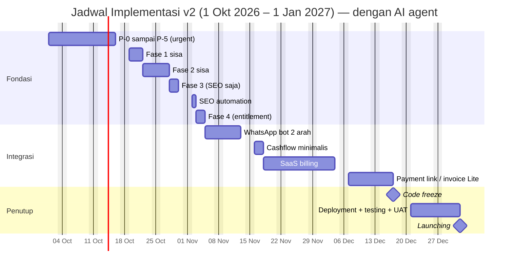

# Jadwal Implementasi — Alfatech Office (SaaS Multi-Tenant)

> **Versi:** 2.0.0 — **REVISI BESAR** (lingkup bertambah + pengerjaan dibantu AI agent).
> **Status:** RENCANA — belum dimulai.
> **Periode:** 1 Oktober 2026 → 31 Desember 2026; coding berhenti **17 Des**, **launching 1 Januari 2027**.
> **Pola kerja:** 4 hari/minggu, **Senin–Kamis** — tersedia **53 hari kerja**.
> **Asumsi kecepatan:** pengerjaan memakai **AI agent**, ±**2,4×** kecepatan manual.
> **Bahasa:** Indonesia; istilah teknis dipertahankan dalam bahasa Inggris.

> ⚠️ **JADWAL INI PAS-PASAN.** Estimasi tengah hanya menyisakan **buffer ±1–2 hari**; skenario pesimis melewati deadline. [Bagian 6](#6-checkpoint--tangga-fallback) berisi checkpoint dan tangga fallback yang **wajib** dijalankan.

Dokumen ini menetapkan **urutan eksekusi per hari kerja** atas:

- `docs/syarhul-implementation-urgent.md` (prioritas P-0 … P-5),
- `docs/implementation/phase-01-fondasi.md` … `phase-04-plan-dan-entitlement.md`,
- `docs/IMPLEMENTATION_PLAN.md` (§17 deployment, §19 roadmap),
- **integrasi pihak ketiga** yang kini disetujui masuk gelombang 1.

---

## 0. Ringkasan Perubahan dari v1.0.0

| #   | Perubahan                                                                                                                               | Alasan                                 |
| --- | --------------------------------------------------------------------------------------------------------------------------------------- | -------------------------------------- |
| 1   | **Pengerjaan dibantu AI agent** (asumsi ±2,4×)                                                                                          | Instruksi pemilik produk               |
| 2   | Lingkup bertambah: **WhatsApp bot 2 arah**, **cashflow minimalis**, **SEO automation**, **SaaS billing**, **payment link/invoice Lite** | Kebutuhan bisnis                       |
| 3   | Empat item di atas **tidak lagi disekop ke Fase 5** — kini masuk gelombang 1                                                            | Keputusan pemilik produk               |
| 4   | **Fase 3 bagian domain** (`TenantResolver` + desain tabel `domains`) ditunda ke gelombang 2                                             | Trade-off agar jadwal muat             |
| 5   | **Billing UI** (upgrade/downgrade) ditunda ke gelombang 2                                                                               | Keputusan pemilik produk               |
| 6   | **Full e-commerce** (katalog, keranjang, checkout) ditunda ke gelombang 2                                                               | Keputusan pemilik produk ("Lite dulu") |
| 7   | Jadwal harian dipadatkan; gate fase dilebur ke hari kerja biasa                                                                         | Menyesuaikan volume pekerjaan baru     |

---

## 1. Lingkup: Gelombang 1 vs Gelombang 2

### Gelombang 1 — wajib selesai sebelum **1 Januari 2027**

| Kode | Item                                                                                                           | Hari (AI) |
| ---- | -------------------------------------------------------------------------------------------------------------- | --------: |
| F-1  | Fondasi: **P-0 … P-5** (version control, isolasi tenant, global scope, MySQL/Redis, glosarium, audit + backup) |         8 |
| F-2  | Fase 1 sisa (dokumentasi, storage seam, config, SSR + meta dasar, audit keamanan)                              |         3 |
| F-3  | Fase 2 sisa (siklus hidup tenant, settings, cache/queue/log sadar tenant)                                      |         3 |
| F-4  | Fase 3 **SEO saja** (meta/OG/canonical/JSON-LD/robots/sitemap per tenant)                                      |         2 |
| F-5  | Fase 4 (Feature enum, plan di config, entitlement service, integrasi frontend)                                 |         2 |
| I-1  | **WhatsApp bot dua arah** (webhook, state percakapan, balasan otomatis, log, kuota)                            |         5 |
| I-2  | **Cashflow minimalis** (laporan periode/kategori, dashboard, ekspor)                                           |       2,5 |
| I-3  | **SEO automation** (otomasi meta/schema, ping sitemap)                                                         |         2 |
| I-4  | **SaaS billing** (plans, subscriptions, state machine, invoice, dunning, webhook)                              |        10 |
| I-5  | **Payment link/invoice Lite** (Snap, webhook, status sync, tanda terima, reminder)                             |       7,5 |
| F-6  | Integration testing + hardening                                                                                |         1 |
| D-1  | Deployment + testing + UAT                                                                                     |       5–6 |
|      | **TOTAL**                                                                                                      | **51–52** |

### Gelombang 2 — target **Februari–Maret 2027**

| Kode | Item                                                                                          | Alasan ditunda                                                          |
| ---- | --------------------------------------------------------------------------------------------- | ----------------------------------------------------------------------- |
| G-1  | **Full e-commerce** (katalog, varian, stok, keranjang, checkout, ongkir, storefront, pesanan) | "Lite dulu"; dokumen B-4 menyebutnya _bisnis baru, bukan sekadar modul_ |
| G-2  | **Billing UI** (paket saya, upgrade/downgrade)                                                | Keputusan pemilik produk                                                |
| G-3  | **Fase 3 domain** (`TenantResolver`, desain tabel `domains`, pemisahan route publik)          | Trade-off jadwal; custom domain belum disetujui (PDR-04)                |
| G-4  | Sisa backlog Fase 5 (custom domain penuh, AI, analytics, media manager, dsb.)                 | Belum disetujui                                                         |

---

## 2. Asumsi, Faktor AI & Sensitivitas

| #   | Asumsi                                                                          |
| --- | ------------------------------------------------------------------------------- |
| A-1 | Pengerjaan memakai **AI agent** untuk menulis kode, test, dan dokumen.          |
| A-2 | **Manusia tetap wajib me-review** semua keluaran AI sebelum merge.              |
| A-3 | Percepatan bersih yang diasumsikan: **±2,4×** dibanding pengerjaan manual.      |
| A-4 | Proyek dikerjakan **solo**; AI tidak menghilangkan kebutuhan keputusan manusia. |
| A-5 | **Belum** memperhitungkan cuti pribadi, tanggal merah, atau sakit.              |
| A-6 | Coding **berhenti** Kamis **17 Desember 2026** (2 minggu sebelum launching).    |
| A-7 | CI **sudah ada** (`.github/workflows/tests.yml`, `composer ci:check`).          |
| A-8 | Total hari kerja tersedia: **53 hari** (17 Okt + 17 Nov + 19 Des).              |

**Sensitivitas terhadap asumsi percepatan** — ini titik paling rapuh:

| Percepatan AI                 |              Total hari | Terhadap 53 hari  |
| ----------------------------- | ----------------------: | ----------------- |
| 3,0×                          |                     ±42 | ✔ Buffer +11      |
| **2,4× (asumsi dokumen ini)** | **±52** (rentang 44–61) | ⚠️ Buffer ±0      |
| 2,0×                          |                     ±61 | ❌ Lewat ±8 hari  |
| 1,5×                          |                     ±79 | ❌ Lewat ±26 hari |

> **Artinya:** jadwal ini hanya berlaku bila AI benar-benar bekerja di ±2,4×. Bila kenyataannya 2×, deadline 1 Januari **lewat**. Karena itu [Bagian 6](#6-checkpoint--tangga-fallback) bersifat **wajib**, bukan opsional.

---

## 3. Estimasi & Buffer

| Blok                             |                   Hari |
| -------------------------------- | ---------------------: |
| Fondasi (F-1 … F-5)              |                     18 |
| Integrasi (I-1 … I-5)            |                     27 |
| Hardening (F-6)                  |                      1 |
| **Subtotal coding**              |                 **46** |
| Deployment + testing + UAT (D-1) |                    5–6 |
| **TOTAL**                        |              **51–52** |
| **Tersedia**                     |                 **53** |
| **Buffer**                       | **+1 s.d. +2 hari** ⚠️ |

> Angka memakai **estimasi tengah**. Skenario optimis menyisakan ±9 hari; skenario pesimis melewati deadline ±8 hari (lihat tabel sensitivitas di [Bagian 2](#2-asumsi-faktor-ai--sensitivitas)).

---

## 4. Ringkasan Blok Pekerjaan

| Blok                                      | Periode              | Hari |
| ----------------------------------------- | -------------------- | ---: |
| **P-0 … P-5** (prioritas urgent)          | 1 – 15 Okt 2026      |    8 |
| Fase 1 — sisa                             | 19 – 21 Okt 2026     |    3 |
| Fase 2 — sisa                             | 22 – 27 Okt 2026     |    3 |
| Fase 3 — **SEO saja**                     | 28 – 29 Okt 2026     |    2 |
| SEO automation                            | 02 Nov 2026          |    1 |
| Fase 4 — Plan & Entitlement               | 03 – 04 Nov 2026     |    2 |
| Integrasi **WhatsApp bot (2 arah)**       | 05 – 12 Nov 2026     |    5 |
| Integrasi **Cashflow minimalis**          | 16 – 17 Nov 2026     |  2,5 |
| Integrasi **SaaS billing**                | 17 Nov – 03 Des 2026 |   10 |
| Integrasi **Payment link/invoice (Lite)** | 07 – 16 Des 2026     |  7,5 |
| Hardening + 🧊 **Code Freeze**            | 17 Des 2026          |    1 |
| **Deployment, testing & UAT**             | 21 – 31 Des 2026     |  5–6 |
| **🚀 Launching**                          | **1 Jan 2027**       |    — |

---

## 5. Jadwal Rinci

> Legenda: 🟥 = **jangan digeser** (jaring pengaman produk) · 🚦 = checkpoint · 🧊 = code freeze

### 5.1 Oktober 2026 — Fondasi + Prioritas Urgent

| Tanggal                        | Tugas                                                                                                                                                                                                                                                                                                                        | Rujukan                                       |
| ------------------------------ | ---------------------------------------------------------------------------------------------------------------------------------------------------------------------------------------------------------------------------------------------------------------------------------------------------------------------------- | --------------------------------------------- |
| **Kamis, 01 Oktober 2026** 🟥  | **P-0 — Version control.** `git init`, audit `.gitignore` (pastikan `docs/` & `.env.example` terlacak), commit pertama, push ke GitHub. Tinjau `.github/workflows/tests.yml`. **Mulai juga (paralel):** daftar akun provider — **Midtrans/Xendit (KYC)** dan **WhatsApp BSP** — proses ini waktu kalender, bukan hari kerja. | syarhul **P-0**; Fase 1 — 1.1.6               |
| **Senin, 05 Oktober 2026** 🟥  | **P-1 — Helper + test `index`.** Helper dua tenant berdata **mirip** + test `index` 8 modul: `projects`, `tasks`, `leads`, `content_items`, `transactions`, `portfolio_items`, `activity_logs`, `company_profiles`.                                                                                                          | syarhul **P-1**; Fase 1 — 1.2.1, 1.2.2        |
| **Selasa, 06 Oktober 2026** 🟥 | **P-1 — Batas kepemilikan + bukti + CI.** Test `update`/`delete` lintas tenant → 404/403; non-anggota → 403; halaman publik & form konsultasi tenant B; **buktikan suite GAGAL** saat `->forTeam()` dihapus; wajibkan suite isolasi di CI.                                                                                   | Fase 1 — 1.2.3 s/d 1.2.7                      |
| **Rabu, 07 Oktober 2026** 🟥   | **P-2 — `TenantContext`.** Singleton (asal: `path`/`host`/`console`/`platform`); migrasikan `CurrentTeam::from()` & `$request->team()`; `runFor()`; pastikan konteks dibersihkan antar request/job; bagikan via `HandleInertiaRequests`.                                                                                     | Fase 2 — 2.1.1 s/d 2.1.5                      |
| **Kamis, 08 Oktober 2026** 🟥  | **P-2 — Global scope (1).** Scope di `BelongsToTeam` untuk `company_profiles`, `projects`, `tasks`; aktifkan **fail-loud**; sediakan `withoutTeamScope()`. Jalankan suite isolasi **setiap model**.                                                                                                                          | Fase 2 — 2.2.1 s/d 2.2.3                      |
| **Senin, 12 Oktober 2026** 🟥  | **P-2 — Global scope (2).** Lanjut `leads`, `content_items`, `transactions`, `portfolio_items`, `activity_logs` + test tiap model.                                                                                                                                                                                           | Fase 2 — 2.2.1                                |
| **Selasa, 13 Oktober 2026** 🟥 | **P-2 — Jalur khusus + audit.** Platform layer, seeder, command, scheduler memakai konteks eksplisit; audit setiap `withoutTeamScope()`; rapikan `->forTeam()` redundan; buktikan suite isolasi tetap hijau **tanpa mengubah ekspektasi**.                                                                                   | Fase 2 — 2.2.4 s/d 2.2.7                      |
| **Rabu, 14 Oktober 2026**      | **P-3 — CI cross-engine + Redis.** Matriks CI MySQL 8 & Postgres; guard `APP_ENV=production` ≠ SQLite; pindahkan `CACHE_STORE`/`SESSION_DRIVER`/`QUEUE_CONNECTION` ke Redis; rapikan `.env.example`.                                                                                                                         | syarhul **P-3**; Fase 1 — 1.4.1, 1.4.3, 1.4.5 |
| **Kamis, 15 Oktober 2026**     | **P-4 — Glosarium** (`Team = Tenant`, README, ADR-02, tanpa rename) **+ P-5 — Audit & backup.** Migrasi `platform_audit_logs` + pencatatan aksi platform + test; backup terjadwal + **uji restore** + dokumentasi.                                                                                                           | syarhul **P-4**, **P-5**; Fase 2 — 2.4        |
| **Senin, 19 Oktober 2026**     | **Fase 1 — dokumentasi + storage seam.** Putuskan & terapkan **D-01**; perbaiki `README.md` (E-1 s/d E-3); disk tenant + `App\Support\TenantStorage` + test prefix & penolakan path traversal.                                                                                                                               | Fase 1 — 1.1.3–1.1.5, 1.3                     |
| **Selasa, 20 Oktober 2026**    | **Fase 1 — config + SSR.** Kunci `config/tenancy.*` (default `null`); `.env.example` acuan produksi; `npm run build:ssr` → `bootstrap/ssr`; dokumentasi proses SSR Node.                                                                                                                                                     | Fase 1 — 1.4.2, 1.5.1, 1.5.2                  |
| **Rabu, 21 Oktober 2026**      | **Fase 1 — meta dasar + audit keamanan + Gate.** Meta title/description dari profil tenant + verifikasi **HTML mentah**; audit `is_platform_admin`, `team_id` fillable, validasi skema URL, `Password::defaults`; regression penuh + update living document.                                                                 | Fase 1 — 1.5.3, 1.5.4, 1.6; Gate Fase 1       |
| **Kamis, 22 Oktober 2026**     | **Fase 2 — siklus hidup tenant.** Migrasi `teams.suspended_at`; aksi suspend/aktifkan platform + audit; guard menolak tenant disuspend (shell **dan** halaman publik → 404); kolom status di `platform/tenants/Index.vue`; test.                                                                                             | Fase 2 — 2.3                                  |
| **Senin, 26 Oktober 2026**     | **Fase 2 — settings + cache & log.** Kolom `settings` JSON + `$team->setting()` + default `locale`/`timezone`/`currency`; helper kunci cache `tenant:{id}:…`; `Log::withContext(['team_id' => …])`; test.                                                                                                                    | Fase 2 — 2.5, 2.6.1, 2.6.3, 2.6.5             |
| **Selasa, 27 Oktober 2026**    | **Fase 2 — job pattern + Gate.** Pola job tenant-aware (`TenantContext::runFor()`); tinjau scheduler lintas tenant; regression penuh + verifikasi acceptance criteria Fase 2 + update living document.                                                                                                                       | Fase 2 — 2.6.2, 2.6.4; Gate Fase 2            |
| **Rabu, 28 Oktober 2026**      | **Fase 3 (SEO) — meta & structured data.** Meta dinamis, Open Graph, Twitter card, canonical, JSON-LD `LocalBusiness` dari data profil tenant.                                                                                                                                                                               | Fase 3 — 3.5.2 s/d 3.5.6                      |
| **Kamis, 29 Oktober 2026**     | **Fase 3 (SEO) — robots & sitemap + Gate.** `robots.txt` + `sitemap.xml` per tenant (hormati `public_page_enabled`); test ≥2 tenant; verifikasi meta dari **HTML SSR** (`curl`).                                                                                                                                             | Fase 3 — 3.5.7 s/d 3.5.10; Gate Fase 3        |

### 5.2 November 2026 — Fase 4 + Integrasi

| Tanggal                        | Tugas                                                                                                                                                                                                                                  | Rujukan                                         |
| ------------------------------ | -------------------------------------------------------------------------------------------------------------------------------------------------------------------------------------------------------------------------------------- | ----------------------------------------------- |
| **Senin, 02 November 2026**    | **SEO automation.** Otomasi meta/schema dari data tenant; ping sitemap; pastikan tidak membocorkan data non-publik.                                                                                                                    | Fase 5 — B-8 (disetujui gelombang 1)            |
| **Selasa, 03 November 2026**   | **Fase 4 — `Feature` enum + `config/plans.php`.** Enum hanya fitur nyata; definisikan `basic`/`plus`/`pro` + `default_plan`; test validasi nama fitur terhadap enum.                                                                   | Fase 4 — 4.1, 4.2                               |
| **Rabu, 04 November 2026**     | **Fase 4 — entitlement + frontend.** `Team::can()`, `features()`, helper otorisasi backend, larangan `if ($plan === …)`; prop `features` + `useFeatures()` + tipe TS; desain `plans`/`subscriptions`/`usage_counters`/`tenant_addons`. | Fase 4 — 4.3 s/d 4.6                            |
| **Kamis, 05 November 2026**    | **WhatsApp (1) — pengiriman dasar.** Provider (BSP / Meta Cloud API), service pengiriman, job tenant-aware (`runFor()`), antrian + retry, kredensial per environment.                                                                  | Fase 5 — B-3 (disetujui)                        |
| **Senin, 09 November 2026**    | **WhatsApp (2) — webhook masuk.** Endpoint webhook + verifikasi signature, routing pesan ke tenant yang tepat, penyimpanan pesan masuk.                                                                                                | B-3                                             |
| **Selasa, 10 November 2026**   | **WhatsApp (3) — bot dua arah.** State percakapan, balasan otomatis, penghubung ke lead/follow-up (`leads.next_follow_up`).                                                                                                            | B-3                                             |
| **Rabu, 11 November 2026**     | **WhatsApp (4) — template, log & kuota.** Template pesan, log pengiriman, kuota per tenant, rate limit, penanganan opt-out.                                                                                                            | B-3                                             |
| **Kamis, 12 November 2026** 🚦 | **WhatsApp (5) — test + hardening. CHECKPOINT-1.** Uji end-to-end + isolasi tenant pada pesan. **Bila lewat >2 hari → turunkan ke notifikasi satu arah** (hemat 1–2 hari).                                                             | B-3; [Bagian 6](#6-checkpoint--tangga-fallback) |
| **Senin, 16 November 2026**    | **Cashflow minimalis (1).** Laporan periode & kategori, ringkasan masuk/keluar, resource API dari modul `transactions` yang sudah ada.                                                                                                 | Fase 5 — B-6 (disetujui)                        |
| **Selasa, 17 November 2026**   | **Cashflow minimalis (2) + SaaS billing (mulai).** Dashboard + ekspor + test; lalu tabel `plans`/`subscriptions` + model + state machine langganan.                                                                                    | B-6; Fase 4 — 4.5                               |
| **Rabu, 18 November 2026**     | **SaaS billing (2).** Subscription service, trial, transisi status (`trialing` → `active` → `past_due` → `canceled`), integrasi entitlement (plan → fitur efektif).                                                                    | Fase 5 — B-2                                    |
| **Kamis, 19 November 2026**    | **SaaS billing (3).** Invoice + periode langganan + job pengecekan periode (`schedule:run`) + dunning/reminder.                                                                                                                        | B-2                                             |
| **Senin, 23 November 2026**    | **SaaS billing (4) — provider.** Integrasi Midtrans/Xendit untuk langganan: buat transaksi, terima status.                                                                                                                             | B-2                                             |
| **Selasa, 24 November 2026**   | **SaaS billing (5) — webhook.** Webhook pembayaran **idempoten + terverifikasi signature**, sinkronisasi status langganan, penanganan gagal/retry.                                                                                     | B-2                                             |
| **Rabu, 25 November 2026**     | **SaaS billing (6).** Rekonsiliasi, kuota/usage dasar, **gating fitur di backend** (controller/policy), bukan hanya UI.                                                                                                                | B-2; Fase 4 — RF4-1                             |
| **Kamis, 26 November 2026**    | **SaaS billing (7).** UI tenant minimal "Paket saya" (tanpa upgrade/downgrade — itu gelombang 2) + audit trail perubahan langganan.                                                                                                    | B-2                                             |
| **Senin, 30 November 2026**    | **SaaS billing (8).** Notifikasi (email) tagihan jatuh tempo + reminder + log.                                                                                                                                                         | B-2                                             |

### 5.3 Desember 2026 — SaaS Billing (lanjut), Payment Lite, Code Freeze

| Tanggal                        | Tugas                                                                                                                                                                                                                  | Rujukan           |
| ------------------------------ | ---------------------------------------------------------------------------------------------------------------------------------------------------------------------------------------------------------------------- | ----------------- |
| **Selasa, 01 Desember 2026**   | **SaaS billing (9).** Test end-to-end di **sandbox** provider: langganan baru, perpanjangan, gagal bayar, pembatalan.                                                                                                  | B-2               |
| **Rabu, 02 Desember 2026**     | **SaaS billing (10).** Hardening: idempotensi, log, penanganan error provider, dokumentasi operasional.                                                                                                                | B-2               |
| **Kamis, 03 Desember 2026** 🚦 | **SaaS billing (11) + Gate Fase 4. CHECKPOINT-2.** Regression penuh + verifikasi acceptance Fase 4 & billing. **Bila lewat >3 hari → billing ke gelombang 2**, sementara pakai **invoice manual**.                     | B-2; Gate Fase 4  |
| **Senin, 07 Desember 2026**    | **Payment Lite (1) — invoice tenant.** Tabel `invoices`, CRUD invoice untuk pelanggan tenant, penomoran, status.                                                                                                       | Fase 5 — B-5 Lite |
| **Selasa, 08 Desember 2026**   | **Payment Lite (2) — payment link.** Integrasi Midtrans Snap / Xendit Invoice; pembuatan link; penyimpanan referensi provider.                                                                                         | B-5 Lite          |
| **Rabu, 09 Desember 2026**     | **Payment Lite (3) — webhook.** Webhook pembayaran **idempoten + terverifikasi signature**; sinkronisasi status invoice; penanganan kedaluwarsa.                                                                       | B-5 Lite          |
| **Kamis, 10 Desember 2026** 🚦 | **Payment Lite (4) — halaman publik. CHECKPOINT-3.** Halaman pembayaran publik + tanda terima + halaman status. **Bila lewat >2 hari → Payment Lite ke gelombang 2.**                                                  | B-5 Lite          |
| **Senin, 14 Desember 2026**    | **Payment Lite (5) — reminder & refund.** Reminder tagihan (email/WhatsApp), refund manual, log.                                                                                                                       | B-5 Lite          |
| **Selasa, 15 Desember 2026**   | **Payment Lite (6) — test sandbox.** End-to-end: bayar sukses, gagal, kedaluwarsa, refund; uji isolasi tenant pada invoice.                                                                                            | B-5 Lite          |
| **Rabu, 16 Desember 2026**     | **Payment Lite (7) — hardening.** Dokumentasi, penanganan error, verifikasi tidak ada kebocoran data antar-tenant.                                                                                                     | B-5 Lite          |
| **Kamis, 17 Desember 2026** 🧊 | **CODE FREEZE.** Integration testing menyeluruh, regression penuh, update semua living document, tandai **Release Candidate**, siapkan checklist deployment. **Batas akhir fase coding** (2 minggu sebelum launching). | Fase 1–4 DoD      |

### 5.4 21 – 31 Desember 2026 — Deployment, Testing & UAT

> Jendela ini **bukan** fase coding. Bila coding meleset, keterlambatan diserap **21–22 Desember** dan testing dipadatkan.

| Tanggal                      | Tugas                                                                                                                                                                                                             | Rujukan               |
| ---------------------------- | ----------------------------------------------------------------------------------------------------------------------------------------------------------------------------------------------------------------- | --------------------- |
| **Senin, 21 Desember 2026**  | **Persiapan infrastruktur produksi.** MySQL 8, Redis, queue worker permanen (Supervisor/systemd), scheduler (cron), proses SSR Node, reverse proxy + SSL, `.env` produksi, kredensial provider **mode produksi**. | master plan §17       |
| **Selasa, 22 Desember 2026** | **Deployment + cutover.** Deploy kode, jalankan migrasi, **cutover SQLite → MySQL**, verifikasi tenant pertama, smoke test.                                                                                       | master plan §18.2     |
| **Rabu, 23 Desember 2026**   | **Testing (1).** Acceptance test per modul; uji isolasi tenant **di produksi**; halaman publik + SEO via HTML SSR.                                                                                                | Fase 1–4 Acceptance   |
| **Kamis, 24 Desember 2026**  | **Testing (2).** Uji **backup & restore** produksi; suspend tenant; audit platform; **WhatsApp mode produksi**; **payment mode produksi (nominal kecil)**.                                                        | syarhul P-5; B-2; B-3 |
| **Senin, 28 Desember 2026**  | **Perbaikan temuan.** Bug fixing hasil testing + regression ulang.                                                                                                                                                | —                     |
| **Selasa, 29 Desember 2026** | **UAT / demo stakeholder.** Validasi alur bisnis end-to-end (termasuk alur bayar) + perbaikan akhir.                                                                                                              | —                     |
| **Rabu, 30 Desember 2026**   | **Finalisasi.** Freeze, dokumentasi operasional & runbook, monitoring dasar, verifikasi backup pra-launch.                                                                                                        | master plan §17       |
| **Kamis, 31 Desember 2026**  | **Persiapan go-live.** Checklist akhir, backup pra-launch, konfirmasi DNS/SSL, siap siaga.                                                                                                                        | —                     |
| **Jumat, 01 Januari 2027**   | 🚀 **LAUNCHING.**                                                                                                                                                                                                 | —                     |

---

## 6. Checkpoint & Tangga Fallback

> **Wajib dijalankan.** Jadwal ini tidak punya buffer. Tanpa checkpoint, keterlambatan baru terasa di minggu terakhir — saat sudah tidak bisa ditolong.

### 6.1 Checkpoint

| #    | Tanggal         | Pertanyaan                   | Aksi bila lewat                                                       |
| ---- | --------------- | ---------------------------- | --------------------------------------------------------------------- |
| 🚦 1 | **12 Nov 2026** | WhatsApp bot 2 arah selesai? | Lewat >2 hari → turunkan ke **notifikasi satu arah** (hemat 1–2 hari) |
| 🚦 2 | **03 Des 2026** | SaaS billing selesai?        | Lewat >3 hari → **billing ke gelombang 2**, pakai invoice manual dulu |
| 🚦 3 | **10 Des 2026** | Payment Lite selesai?        | Lewat >2 hari → **Payment Lite ke gelombang 2**                       |
| 🧊 4 | **17 Des 2026** | Semua regression hijau?      | Bila tidak → lanjutkan perbaikan di 21–22 Des, testing dipadatkan     |

### 6.2 Tangga fallback (potong dari atas)

Potong **berurutan** mulai dari yang paling murah dampaknya:

| Urutan | Yang dipotong                    |           Hari dihemat | Dampak bisnis                 |
| -----: | -------------------------------- | ---------------------: | ----------------------------- |
|      1 | Billing UI                       | _sudah_ di gelombang 2 | —                             |
|      2 | Fase 3 domain (`TenantResolver`) | _sudah_ di gelombang 2 | —                             |
|      3 | SEO automation → gelombang 2     |                      2 | Fondasi SEO tetap ada         |
|      4 | WhatsApp → satu arah             |                    1–2 | Bot tidak membalas otomatis   |
|      5 | Payment Lite → gelombang 2       |                    7,5 | Tagihan manual sementara      |
|      6 | Cashflow minimalis → gelombang 2 |                    2,5 | Modul transaksi sudah ada     |
|      7 | SaaS billing → gelombang 2       |                     10 | Penagihan manual sementara    |
|      8 | WhatsApp → gelombang 2           |                      5 | Tidak ada notifikasi WhatsApp |

> **Jangan pernah memotong:** P-0, P-1, P-2 (isolasi tenant) dan D-1 (deployment/testing). Itu jaring pengaman produk.

---

## 7. Yang AI Tidak Bisa Percepat — Mulai Sekarang

Item berikut **tidak** dipercepat AI dan memakan **waktu kalender**, bukan hari kerja. Mulai paralel dengan coding.

| Item                                                  | Kenapa                                         | Mulai        |
| ----------------------------------------------------- | ---------------------------------------------- | ------------ |
| Akun **Midtrans/Xendit** (KYC + dokumen perusahaan)   | Verifikasi manual pihak ketiga, 1–7 hari kerja | **Okt 2026** |
| Akun **WhatsApp Business API / BSP**                  | Verifikasi + peninjauan template pesan         | **Okt 2026** |
| Keputusan **provider** (D-05) untuk billing & payment | Keputusan manusia — belum ada di dokumen       | **Okt 2026** |
| Server produksi, domain, DNS, SSL                     | Kredensial & akses akun                        | **Nov 2026** |
| Instance **Redis** produksi                           | Infrastruktur                                  | **Des 2026** |
| Aktivasi **mode produksi** provider (sandbox → live)  | Setelah KYC selesai                            | **Des 2026** |

---

## 8. Aturan Pakai AI Agent

1. **AI menulis, manusia memutuskan.** Keputusan arsitektur & produk tetap manusia.
2. **Review wajib** (tidak boleh auto-merge) untuk: isolasi tenant (`BelongsToTeam`, `TenantContext`), billing, payment webhook, entitlement.
3. Setiap keluaran AI wajib lulus **`composer test` + `npm run types:check`** sebelum merge.
4. **Jangan** mempercayakan migrasi yang menyentuh data produksi ke AI tanpa review manual.
5. **Webhook pihak ketiga wajib idempoten + terverifikasi signature** — jangan terima hasil AI apa adanya.
6. **Test isolasi tenant tidak boleh ditulis ulang** hanya agar hijau. Kalau gagal, itu temuan.
7. Bila AI menghasilkan kode yang tidak bisa kamu jelaskan, **jangan merge**.

---

## 9. Definition of Done & Quality Gate

Sebuah tugas selesai **hanya bila** (master plan §19.2):

1. `composer test` hijau (pint + phpstan level 7 + phpunit).
2. `npm run types:check` hijau.
3. `npm run build` dijalankan sebelum `php artisan test` bila menyentuh frontend.
4. Test isolasi tenant ditambah/diperbarui bila menyentuh model atau endpoint tenant-scoped.
5. Living document fase terkait diperbarui.
6. Tidak ada fitur yang belum disetujui ikut masuk.

**Quality gate tambahan (gelombang 1):**

- Nol hasil pencarian `plan ===`, `=== 'pro'`, `== 'plus'` di `app/`.
- Setiap `withoutTeamScope()` wajib berkomentar alasan.
- Setiap webhook wajib punya test idempotensi.
- Tidak ada kredensial provider yang di-commit.
- Suite isolasi tenant tidak boleh di-_skip_.

---

## 10. Prasyarat Keputusan per Tanggal

| Tugas                     | Tanggal     | Keputusan wajib sudah ada                 |
| ------------------------- | ----------- | ----------------------------------------- |
| Mulai P-2 Global scope    | 07 Okt 2026 | **D-03**                                  |
| Fase 1 dokumentasi (D-01) | 19 Okt 2026 | **D-01**                                  |
| Fase 1 config produksi    | 20 Okt 2026 | **D-09**, **D-13**                        |
| Fase 1 SSR                | 20 Okt 2026 | **D-16**                                  |
| Fase 2 settings           | 26 Okt 2026 | **D-04**                                  |
| Fase 4 plan               | 03 Nov 2026 | **D-06**, **ADR-06/14**, draft **PDR-01** |
| **WhatsApp**              | 05 Nov 2026 | **Keputusan provider WhatsApp**           |
| **SaaS billing**          | 18 Nov 2026 | **D-05** (provider), **PDR-05**           |
| **Payment Lite**          | 07 Des 2026 | **D-05** (provider)                       |

> Bila keputusan belum ada, **jangan menebak** — geser tugas dan catat di living document.

---

## 11. Pemetaan Prioritas Urgent ↔ Jadwal

| Prioritas                              | Tanggal              | Setara dengan             |
| -------------------------------------- | -------------------- | ------------------------- |
| **P-0** Version control                | 01 Okt 2026          | Fase 1 — 1.1.6            |
| **P-1** Test isolasi tenant            | 05 – 06 Okt 2026     | Fase 1 — 1.2              |
| **P-2** Global scope                   | 07 – 13 Okt 2026     | Fase 2 — 2.1, 2.2         |
| **P-3** MySQL + Redis                  | 14 Okt 2026          | Fase 1 — 1.4.3/1.4.5, §17 |
| **P-4** Istilah "team"                 | 15 Okt 2026          | Fase 1 — 1.1.x + ADR-02   |
| **P-5** Audit + backup                 | 15 Okt 2026          | Fase 2 — 2.4 + §17        |
| Integrasi B-2, B-3, B-5 Lite, B-6, B-8 | 02 Nov – 16 Des 2026 | **Disetujui gelombang 1** |
| B-4, Billing UI, Fase 3 domain         | **Gelombang 2**      | Ditunda                   |

---

## 12. Catatan Penutup

1. Dokumen ini **memperluas lingkup** dibanding v1.0.0 — perluasan itu berdasarkan keputusan pemilik produk (AI agent + empat integrasi).
2. **Perluasan ini bertentangan dengan `phase-05-fitur-masa-depan.md`** yang menyatakan item tersebut DEFERRED. Dokumen fase perlu diperbarui agar tidak saling bertentangan.
3. **P-0 dan P-1 tetap jaring pengaman** dan tidak boleh dikompromikan.
4. Jadwal ini **bersyarat**: berlaku bila percepatan AI benar-benar ±2,4×. [Bagian 6](#6-checkpoint--tangga-fallback) **wajib** dijalankan.
5. Bila 1 Januari terasa terlalu berisiko, opsi paling sehat: **mundurkan launching ke 15 Januari 2027** (+8 hari kerja → buffer ±9 hari).
6. Dokumen ini **melengkapi**, bukan menggantikan `docs/IMPLEMENTATION_PLAN.md` dan kelima dokumen fase.

---

## Riwayat Perubahan

| Versi | Tanggal    | Perubahan                                                                                                                                                                                                                                                                                                 | Penulis            |
| ----- | ---------- | --------------------------------------------------------------------------------------------------------------------------------------------------------------------------------------------------------------------------------------------------------------------------------------------------------- | ------------------ |
| 1.0.0 | 2026-09-30 | Jadwal implementasi awal (1 Okt 2026 – 1 Jan 2027)                                                                                                                                                                                                                                                        | Software Architect |
| 2.0.0 | 2026-09-30 | **Revisi besar.** Pengerjaan dengan AI agent (±2,4×); lingkup bertambah (WhatsApp bot 2 arah, cashflow minimalis, SEO automation, SaaS billing, payment link Lite); Fase 3 domain, Billing UI, dan Full e-commerce dipindah ke gelombang 2; ditambah checkpoint, tangga fallback, dan aturan pemakaian AI | Software Architect |
